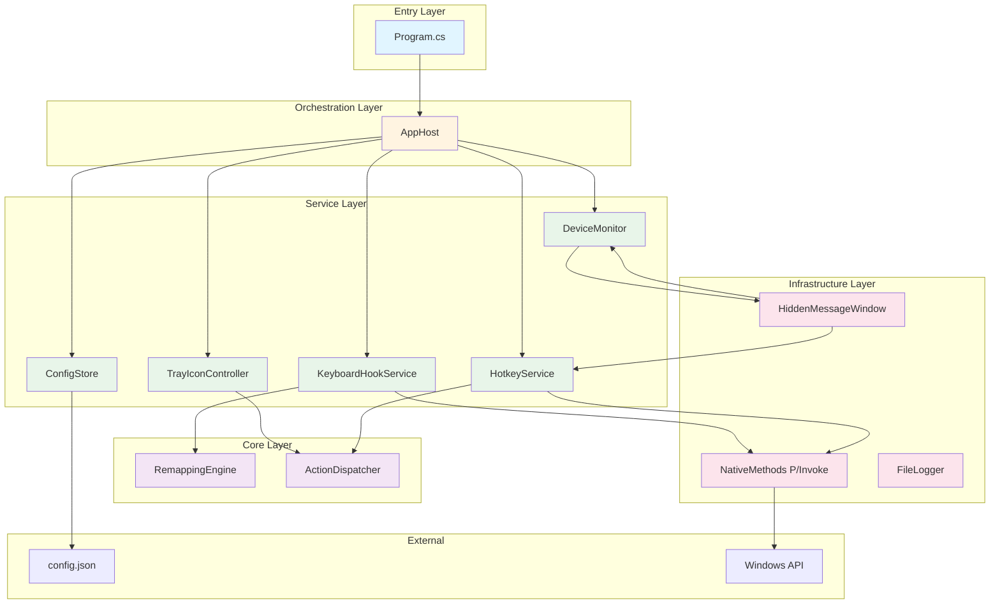
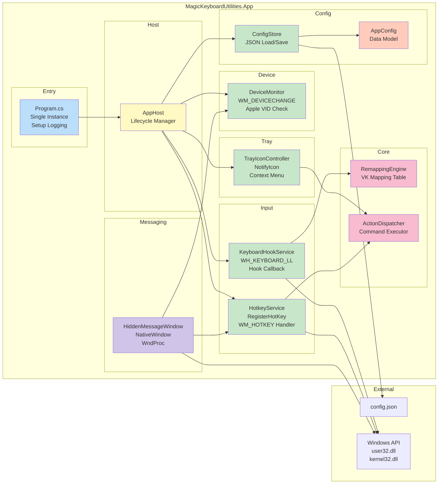
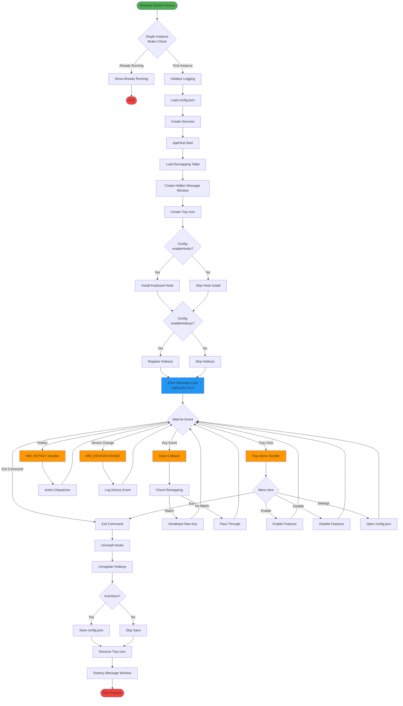
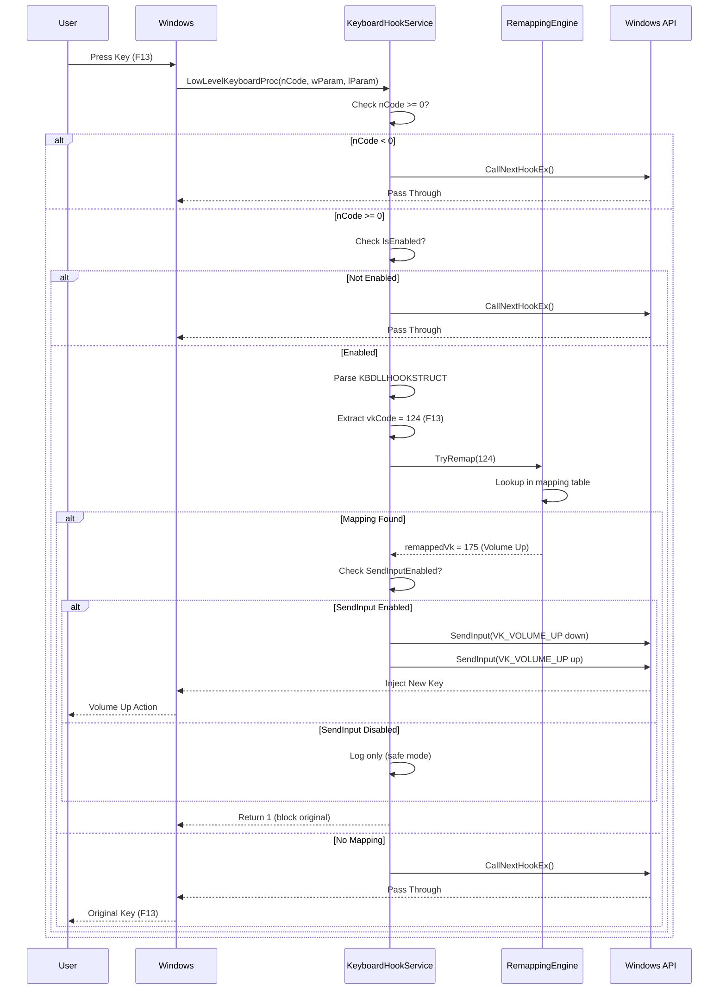
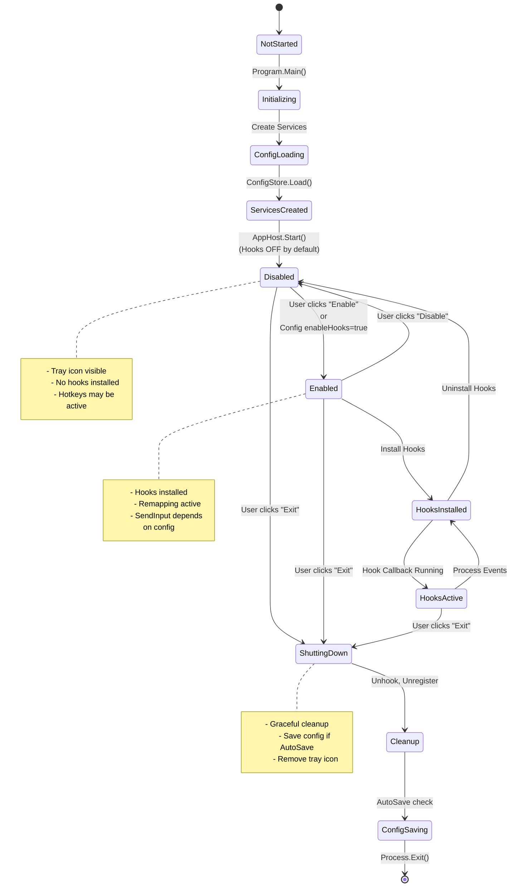
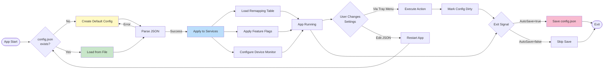

# DESIGN DOCUMENT

## Mục Đích

Tài liệu thiết kế kiến trúc của **MagicKeyboardUtilities Reimplementation**, bao gồm:
- Lý do chọn công nghệ
- Sơ đồ luồng chạy (Mermaid diagrams)
- Kiến trúc component
- State machines

## Công Nghệ & Lý Do

### .NET 8 + WinForms

**Lý do chọn:**
- ✅ Native support cho NotifyIcon (tray icon)
- ✅ NativeWindow cho message-only windows (WM_DEVICECHANGE, WM_HOTKEY)
- ✅ P/Invoke user32.dll dễ dàng (hooks, hotkeys, SendInput)
- ✅ Không cần visible window → WinForms ApplicationContext phù hợp
- ✅ .NET logging framework built-in
- ✅ System.Text.Json cho config

**So với WPF:**
- WPF phức tạp hơn cho background app
- NotifyIcon trong WPF cần Forms compatibility
- WinForms đơn giản hơn cho app không có UI

### Architecture Pattern: Service-based

**Lý do:**
- Mỗi chức năng = 1 service (Hook, Hotkey, Device, Config, Tray)
- AppHost orchestrates lifecycle
- Dễ test (dependency injection friendly)
- Dễ toggle on/off từng feature

## Kiến Trúc Tổng Thể

### Layer Diagram



### Component Diagram



## Luồng Chạy Chi Tiết

### 1. Overall Flow (Startup → Running → Shutdown)



### 2. Hook Callback Sequence



### 3. State Machine



### 4. Configuration Flow



## Design Decisions

### 1. Tại Sao Dùng WinForms ApplicationContext?

**Lý do:**
- App chạy nền, không cần visible window
- ApplicationContext.Run() vẫn có message loop
- NotifyIcon tự động hoạt động trong context
- Không cần Form.ShowInTaskbar = false tricks

**Code:**
```csharp
Application.Run(); // Runs message loop without form
```

**Alternative (không chọn):**
- Form với Visible=false → Phức tạp, không cần UI
- Console app với manual message loop → Mất WinForms benefits

### 2. Tại Sao Dùng NativeWindow Thay Vì Form?

**Lý do:**
- Cần nhận WM_DEVICECHANGE và WM_HOTKEY
- Form không cần thiết (no UI)
- NativeWindow nhẹ hơn, chỉ có WndProc
- Message-only window (HWND_MESSAGE parent)

**Code:**
```csharp
CreateHandle(new CreateParams
{
    Parent = new IntPtr(-3) // HWND_MESSAGE
});
```

### 3. Tại Sao Config JSON External Thay Vì Embedded?

**Lý do:**
- ✅ Transparency: User dễ xem/sửa
- ✅ No recompile: Thay đổi config không cần rebuild
- ✅ Debugging: Dễ test các scenarios
- ❌ Original binary: Config embedded/encrypted (không thể reverse)

**Trade-off:**
- Mất obfuscation → Chấp nhận vì mục đích học tập

### 4. Tại Sao Default OFF Cho Hooks?

**Lý do:**
- ⚠️ Safety: Hooks có thể block input nếu config sai
- ⚠️ Evidence: Flow report chỉ INFER hooks, không confirm
- ✅ Testing: User phải enable explicitly sau khi review config

**Migration path:**
1. User review remapping table
2. Enable hooks với SendInput=false (log only)
3. Test mapping logic
4. Enable SendInput=true (live)

### 5. Tại Sao Không Implement Full Device Detection?

**Lý do:**
- ❌ Evidence: Flow report không có chi tiết SetupAPI calls
- ❌ Complexity: SetupDiEnumDeviceInfo, device path parsing phức tạp
- ✅ Stub đủ: Log WM_DEVICECHANGE events
- ⚠️ Future: Có thể hoàn thiện nếu có thêm evidence

**Current implementation:**
- Nhận WM_DEVICECHANGE
- Log device arrival/removal
- Không parse device path → Không check VID/PID

## P/Invoke Signatures

### Critical Win32 APIs

```csharp
// Hook
SetWindowsHookEx(WH_KEYBOARD_LL, callback, hModule, 0)
UnhookWindowsHookEx(hhk)
CallNextHookEx(hhk, nCode, wParam, lParam)

// Hotkey
RegisterHotKey(hWnd, id, modifiers, vk)
UnregisterHotKey(hWnd, id)

// Input
SendInput(nInputs, pInputs, cbSize)

// Message Loop
GetMessage(out MSG, hWnd, min, max)
TranslateMessage(ref MSG)
DispatchMessage(ref MSG)
```

### Safety Considerations

**GC Protection:**
```csharp
// Keep delegate reference to prevent GC
private NativeMethods.LowLevelKeyboardProc? _hookProc;
_hookProc = HookCallback; // Store before SetWindowsHookEx
```

**Exception Handling:**
```csharp
try {
    // Hook callback logic
} catch (Exception ex) {
    _logger.LogError(ex, "Hook error");
    // ALWAYS call CallNextHookEx on exception
    return CallNextHookEx(...);
}
```

## Testing Strategy

### Unit Tests
- ✅ ConfigStore load/save
- ✅ RemappingEngine lookup
- ✅ ActionDispatcher execute

### Manual Tests (Required)
- ⚠️ Hook installation (requires admin on some systems)
- ⚠️ Remapping (safe mode → live mode)
- ⚠️ Hotkey registration
- ⚠️ Device plug/unplug

### No Integration Tests
- ❌ Hooks require real keyboard input (hard to automate)
- ❌ Tray icon requires interactive UI

## Performance Considerations

### Hook Callback
- **Critical**: Must return fast (< 1ms)
- **Avoid**: Heavy processing, I/O, logging in production
- **Current**: Log only in Debug build

### Remapping Lookup
- **Data structure**: Dictionary<int, int> → O(1) lookup
- **Alternative**: Array[256] for VK codes → Faster but wastes memory

### Memory Footprint
- **Target**: < 50 MB (original ~105 MB)
- **Actual**: ~20 MB (unpacked .NET)

## Future Improvements

### If More Evidence Available

1. **Full Device Detection**
   - Implement SetupDiGetClassDevs
   - Parse device interface path
   - Extract VID/PID from path string
   - See Section 8.3 in flow report

2. **Custom Icon**
   - Extract MAINICON from original binary
   - Add to project resources
   - Update NotifyIcon.Icon

3. **Settings UI**
   - WinForms dialog for config editing
   - No need to open JSON manually
   - Validation for VK codes

4. **Installer**
   - MSI package
   - Optional: Auto-start registry entry
   - Digital signature

---

**Version:** 1.0.0  
**Last Updated:** 22/01/2026  
**Traceability:** Flow Report Section 3 (Bản Đồ Luồng), Section 8 (Implementation Checklist)
