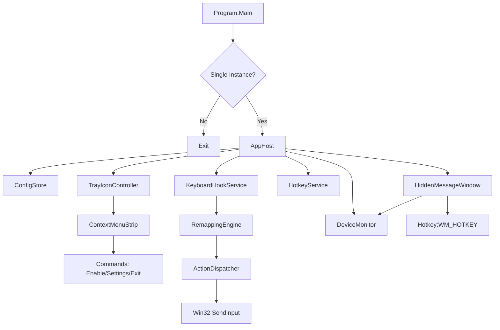

# DESIGN DOCUMENT

## Architecture Overview

The application is designed as a background Windows Forms application (without a visible main window) that manages system hooks and tray interactions.

## Component Details

### 1. AppHost
- Manages the lifecycle of the application.
- Initializes all services (Config, Tray, Hooks).
- Handles the main message loop via `Application.Run(naviteWindow)`.

### 2. HiddenMessageWindow (NativeWindow)
- Extends `System.Windows.Forms.NativeWindow`.
- Created via `CreateHandle` with `CP_NOCLOSE_BUTTON`.
- Receives `WM_DEVICECHANGE` and `WM_HOTKEY`.
- Forwards messages to `DeviceMonitor` and `HotkeyService`.

### 3. KeyboardHookService
- Uses `SetWindowsHookEx` with `WH_KEYBOARD_LL`.
- Callback runs on the main thread (message loop).
- Intercepts keys based on `RemappingEngine` results.
- **Safety**: Wrapped in try/catch to ensure unhooking on crash.

### 4. DeviceMonitor
- Registers for `GUID_DEVCLASS_KEYBOARD` notifications.
- Parses `WM_DEVICECHANGE` to detect Apple vendor ID (0x05AC) in device paths.

### 5. Configuration
- `config.json` stores user preferences.
- Loaded at startup.
- Autosave on exit (optional).

## Technology Choices

- **WinForms vs WPF**: WinForms is chosen for its lightweight wrapper around Win32 message loops (`ApplicationContext`, `NativeWindow`), which fits the "background tray app" requirement perfectly. WPF introduces unnecessary overhead for a UI-less application.
- **P/Invoke**: Essential for low-level hooks (`user32.dll`) and device notifications (`user32.dll`, `dbt.h`).
- **JSON Config**: Simple, human-readable, and easy to edit without custom tools.
