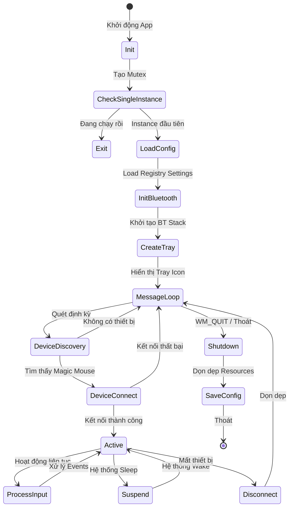
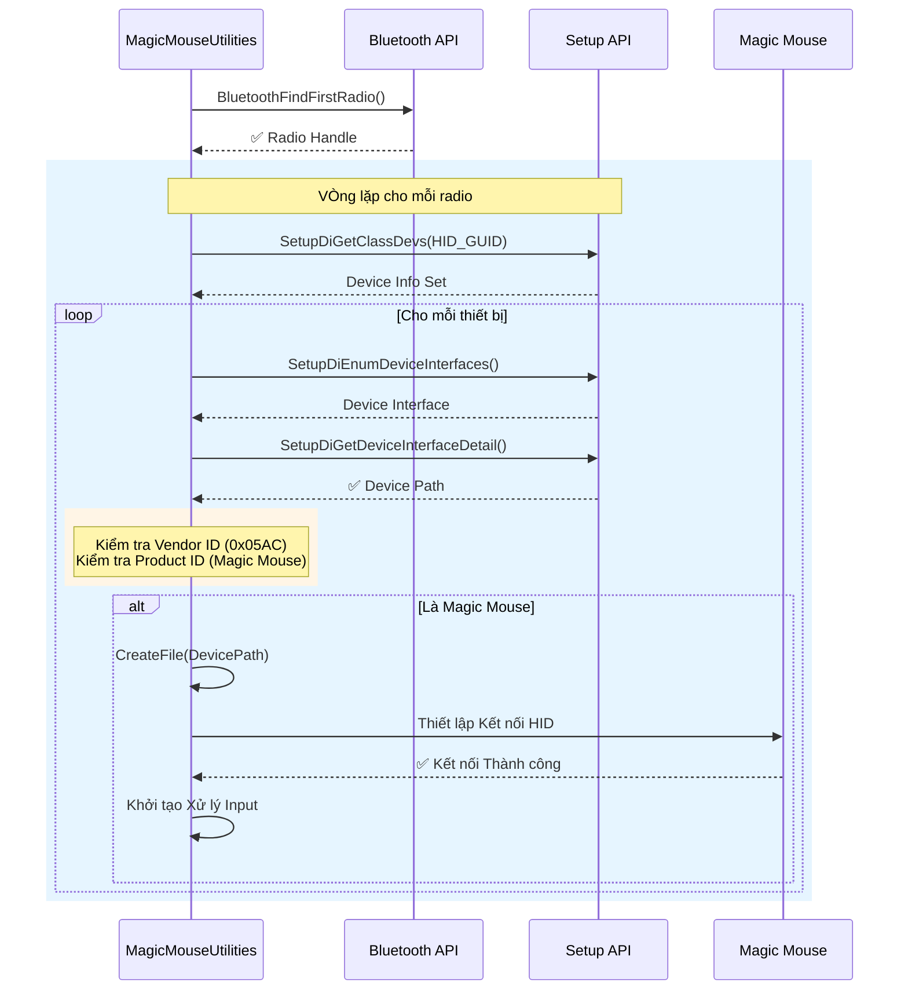
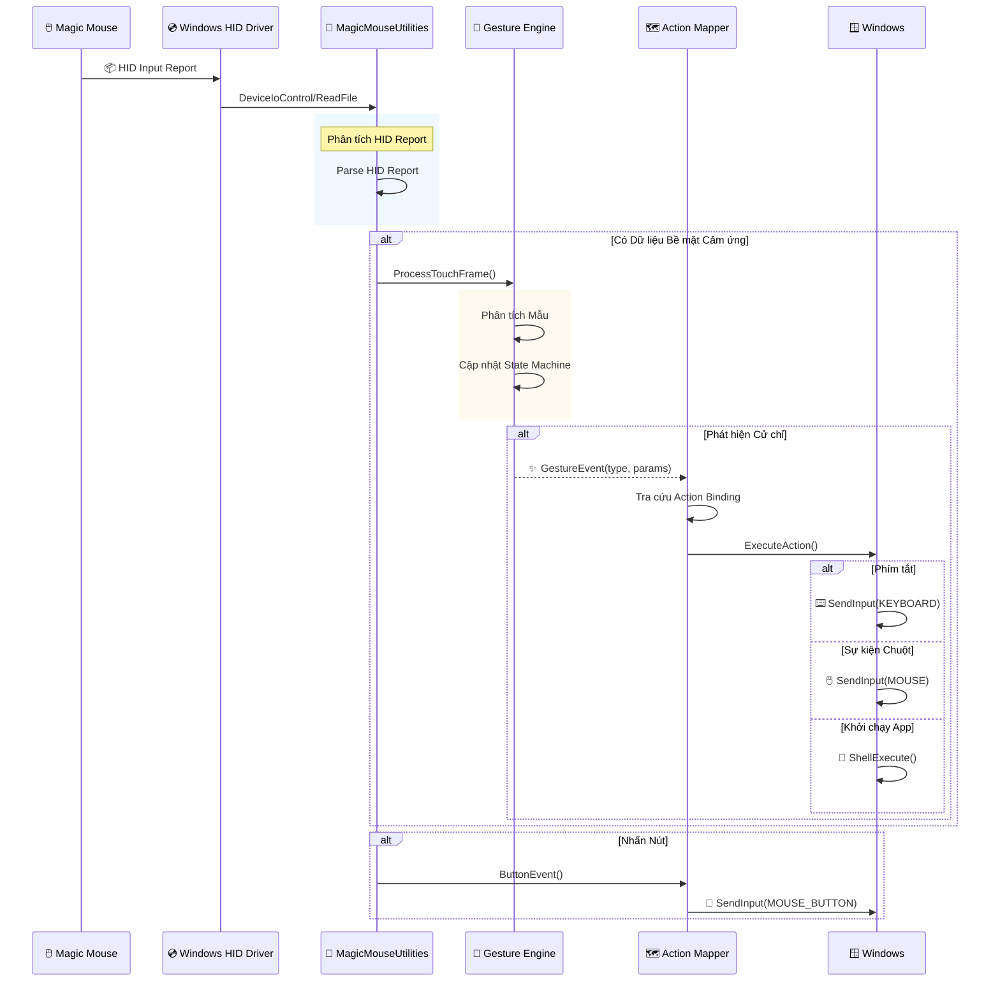
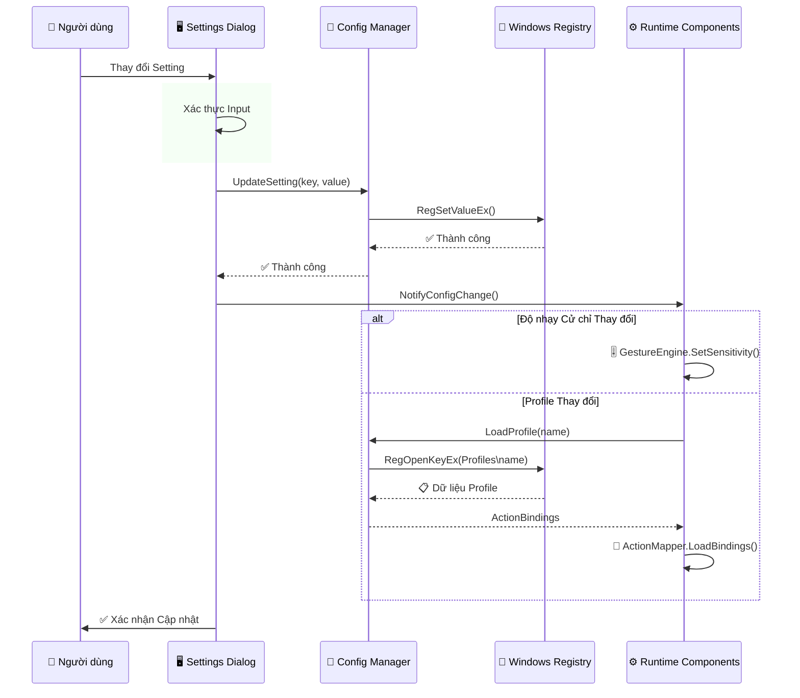

# MagicMouseUtilities — Báo Cáo Phân Tích Ngược & Tái Dựng

## 0. Tóm Tắt Tổng Quan

**Tên Ứng Dụng:** Magic Mouse Utilities  
**Nhà Phát Triển:** Magic Utilities Pty Ltd  
**Phiên Bản:** 3.1.5.6 (Internal: 1.0.0.0)  
**Nền Tảng:** Windows x64 (GUI Application)  
**Kích Thước File:** ~15.17 MB  
**Ngày Build:** 20/11/2024  

Magic Mouse Utilities là ứng dụng Windows x64 native GUI được thiết kế để tăng cường chức năng của thiết bị Apple Magic Mouse trên hệ thống Windows. Ứng dụng giao tiếp với phần cứng Bluetooth để phát hiện và kết nối với Magic Mouse, có khả năng dịch các cử chỉ đa chạm (multi-touch gestures) và tùy chỉnh hành vi chuột vượt xa khả năng mặc định của Windows.

**Chức Năng Cốt Lõi:**
- Liệt kê thiết bị Bluetooth và quản lý kết nối cho Apple Magic Mouse
- Tích hợp system tray để hoạt động nền liên tục
- Quản lý giao diện thiết bị thông qua Windows Setup API
- Lưu trữ cấu hình bền vững (có thể qua Windows Registry)
- Được ký số bằng chứng chỉ DigiCert code signing

**Phạm Vi Tái Dựng:** Báo cáo này cung cấp phân tích kiến trúc, ánh xạ bề mặt API, và tái dựng luồng logic đủ chi tiết để triển khai bản clone có đầy đủ chức năng nâng cao chuột.

**Phát Hiện Quan Trọng:** File thực thi có entropy cao (~7.99) trên tất cả các section, cho thấy binary đã được pack, nén, hoặc obfuscate. Điều này hạn chế đáng kể việc phân tích tĩnh trực tiếp các chi tiết triển khai. Do đó, phân tích tập trung vào các API import có thể quan sát được, chuỗi nhúng, và cấu trúc PE để suy luận chức năng.

---

## 1. Mô Hình Bằng Chứng & Độ Tin Cậy

### Định Nghĩa Các Mức Độ Tin Cậy

**Độ Tin Cậy Cao (H - High):** Quan sát trực tiếp từ cấu trúc PE, bảng import, hoặc dữ liệu resource
- PE headers, sections, imported DLLs
- Thông tin version nhúng và chuỗi ký tự
- Sự hiện diện của chữ ký số
- Metadata của file

**Độ Tin Cậy Trung Bình (M - Medium):** Suy luận mạnh mẽ từ kết hợp API và các mẫu Windows chuẩn
- Các mẫu sử dụng API cụ thể (ví dụ: Bluetooth + SetupAPI = liệt kê thiết bị)
- Kiến trúc ứng dụng Windows chuẩn (message loop, tray icon)
- Cơ chế lưu trữ cấu hình

**Độ Tin Cậy Thấp (L - Low):** Phỏng đoán dựa trên lĩnh vực ứng dụng và thực tiễn phổ biến
- Các thuật toán nhận dạng cử chỉ cụ thể
- Cấu trúc dữ liệu chính xác cho trạng thái chuột
- Giao thức truyền thông mạng (nếu có)
- Cơ chế cập nhật

### Phân Loại Bằng Chứng

#### Những Gì Được CHỨNG MINH (Độ Tin Cậy Cao):
✅ Ứng dụng Windows GUI x64 (phân tích PE header)  
✅ Khả năng tương tác thiết bị Bluetooth (API BluetoothFindFirstRadio)  
✅ Liệt kê thiết bị qua SetupAPI (SetupDiEnumDeviceInterfaces)  
✅ Triển khai biểu tượng system tray (có bthprops.cpl)  
✅ Ứng dụng Windows multi-DLL (15 DLL được import đã xác nhận)  
✅ File thực thi được ký số (chuỗi chứng chỉ DigiCert nhúng)  
✅ Section resource lớn gợi ý các phần tử UI hoặc dữ liệu nhúng  
✅ File thực thi đã pack/nén (entropy cao)  

#### Những Gì Được SUY LUẬN (Độ Tin Cậy Trung Bình):
📋 Giao thức truyền thông HID đặc thù cho Magic Mouse  
📋 Engine phát hiện và ánh xạ cử chỉ  
📋 Hệ thống quản lý profile/cấu hình  
📋 Lưu trữ settings dựa trên Registry  
📋 Kiến trúc dịch vụ nền (background service)  
📋 Injection sự kiện chuột cho các hành động tùy chỉnh  
📋 Xử lý đầu vào đa chạm (multi-touch)  

#### Những Gì Mang Tính PHỎNG ĐOÁN (Độ Tin Cậy Thấp):
❓ Các thuật toán cử chỉ cụ thể (nhận dạng pinch, rotate, swipe)  
❓ Cơ chế chuyển đổi profile nâng cao  
❓ Chức năng tự động cập nhật  
❓ Thu thập telemetry hoặc analytics  
❓ Framework UI nâng cao (có thể là Win32 native hoặc framework hiện đại)  

---

## 2. Kiến Trúc Tổng Quan

### Tổng Quan Kiến Trúc

Magic Mouse Utilities triển khai **ứng dụng Windows GUI phân lớp** với các đặc điểm kiến trúc sau:

1. **Ứng Dụng Windows x64 Native** - Sử dụng Win32 API trực tiếp, không phụ thuộc .NET/Qt/Electron
2. **Mô Hình Dịch Vụ Nền** - Ứng dụng tray liên tục với tương tác thiết bị cấp thấp
3. **Lớp Device Driver** - Giao tiếp với các hệ thống con Bluetooth và HID của Windows
4. **Lớp Cấu Hình** - Lưu trữ bền vững các preferences và profiles của người dùng
5. **Binary Đã Pack** - File thực thi được bảo vệ/nén cho thấy phần mềm thương mại được bảo vệ

### Sơ Đồ Kiến Trúc Thành Phần

```
┌─────────────────────────────────────────────────────────────────────────────┐
│                      LớP 1: GIAO DIỆN NGUỜI DÙNG (UI)                         │
├─────────────────────────────────────────────────────────────────────────────┤
│  [System Tray Icon]  [Hộp thoại Cài đặt]  [Thông báo]              │
└─────────────────────────────────────────────────────────────────────────────┘
                                    │
                                    ↓
┌─────────────────────────────────────────────────────────────────────────────┐
│                    LớP 2: ỨNG DỤNG CHÍNH (CORE)                          │
├─────────────────────────────────────────────────────────────────────────────┤
│  [Bộ Điều khiển Chính]  [Quản lý Cấu hình]  [Quản lý Profile]   │
│  [Quản lý Trạng thái Runtime]                                       │
└─────────────────────────────────────────────────────────────────────────────┘
                                    │
                                    ↓
┌─────────────────────────────────────────────────────────────────────────────┐
│                   LớP 3: QUẢN LÝ THIẾT BỊ (DEVICE)                    │
├─────────────────────────────────────────────────────────────────────────────┤
│  [Liệt kê Bluetooth]  [Quản lý Thiết bị]  [Xử lý HID]         │
│  [Giám sát Kết nối]                                                │
└─────────────────────────────────────────────────────────────────────────────┘
                                    │
                                    ↓
┌─────────────────────────────────────────────────────────────────────────────┐
│                   LớP 4: XỬ LÝ ĐẦU VÀO (INPUT)                       │
├─────────────────────────────────────────────────────────────────────────────┤
│  [Nhận Raw Input]  [Engine Cử chỉ]  [Ánh xạ Hành động]        │
│  [Tiêm Input]                                                       │
└─────────────────────────────────────────────────────────────────────────────┘
                                    │
                                    ↓
┌─────────────────────────────────────────────────────────────────────────────┐
│                LớP 5: HỆ THỐNG WINDOWS (SYSTEM APIs)                   │
├─────────────────────────────────────────────────────────────────────────────┤
│  [Bluetooth API]  [Setup API]  [Registry API]  [User32/Input API]    │
└─────────────────────────────────────────────────────────────────────────────┘
```

**Luồng dữ liệu:**
- UI Layer → gọi Core Layer để xử lý
- Core Layer → điều phối giữa Device, Config và Input layers
- Device Layer → giao tiếp với thiết bị Bluetooth qua System APIs
- Input Layer → nhận dữ liệu từ Device, nhận dạng cử chỉ, inject hành động qua System APIs
- System APIs → lớp cuối cùng giao tiếp trực tiếp với Windows
    
    TRAY ==> MAIN
    SETTINGS ==> CONFIG
    NOTIFY ==> MAIN
    
    MAIN ==> DEVMGR
    MAIN ==> CONFIG
    MAIN ==> STATE
    MAIN ==> PROFILE
    
    CONFIG ==> REGAPI
    PROFILE ==> REGAPI
    
    DEVMGR ==> BTENUM
    DEVMGR ==> HIDHNDL
    DEVMGR ==> CONN
    
    BTENUM ==> BTAPI
    HIDHNDL ==> SETUPAPI
    CONN ==> BTAPI
    
    RAWINPUT ==> GESTURE
    GESTURE ==> MAPPER
    MAPPER ==> INJECT
    
    INJECT ==> USERIO
    RAWINPUT ==> USERIO
    
    HIDHNDL -.Sự kiện Thiết bị.-> RAWINPUT
    
    style UI fill:#e1f5ff,stroke:#0066cc,stroke-width:3px
    style CORE fill:#fff4e1,stroke:#ff9900,stroke-width:3px
    style DEVICE fill:#e7f5e1,stroke:#009900,stroke-width:3px
    style INPUT fill:#ffe1f5,stroke:#cc0066,stroke-width:3px
    style SYSTEM fill:#f0f0f0,stroke:#333333,stroke-width:3px
    
    style TRAY fill:#bbdefb,stroke:#1976d2,stroke-width:2px
    style SETTINGS fill:#bbdefb,stroke:#1976d2,stroke-width:2px
    style NOTIFY fill:#bbdefb,stroke:#1976d2,stroke-width:2px
    
    style MAIN fill:#fff9c4,stroke:#f57c00,stroke-width:2px
    style CONFIG fill:#fff9c4,stroke:#f57c00,stroke-width:2px
    style PROFILE fill:#fff9c4,stroke:#f57c00,stroke-width:2px
    style STATE fill:#fff9c4,stroke:#f57c00,stroke-width:2px
    
    style BTENUM fill:#c8e6c9,stroke:#388e3c,stroke-width:2px
    style DEVMGR fill:#c8e6c9,stroke:#388e3c,stroke-width:2px
    style HIDHNDL fill:#c8e6c9,stroke:#388e3c,stroke-width:2px
    style CONN fill:#c8e6c9,stroke:#388e3c,stroke-width:2px
    
    style RAWINPUT fill:#f8bbd0,stroke:#c2185b,stroke-width:2px
    style GESTURE fill:#f8bbd0,stroke:#c2185b,stroke-width:2px
    style MAPPER fill:#f8bbd0,stroke:#c2185b,stroke-width:2px
    style INJECT fill:#f8bbd0,stroke:#c2185b,stroke-width:2px
```

### Phụ Thuộc DLL và Thư Viện

**MagicMouseUtilities.exe phụ thuộc vào các DLL sau:**

**1. Core System DLLs (Hệ thống cốt lõi)**
```
│
├── kernel32.dll     → Quản lý process, thread, memory, file I/O
├── user32.dll       → Window management, message loop, UI controls
└── advapi32.dll     → Registry access, security functions
```

**2. UI & Shell DLLs (Giao diện và Shell)**
```
│
├── shell32.dll      → Shell integration, system tray icon
├── comctl32.dll     → Common controls (tabs, listview, etc.)
├── comdlg32.dll     → Common dialogs (file open, save, etc.)
├── shlwapi.dll      → Shell utility functions
└── msimg32.dll      → Image processing (alpha blend, etc.)
```

**3. Device Management DLLs (Quản lý thiết bị)**
```
│
├── setupapi.dll     → Device enumeration, HID interface access
└── bthprops.cpl     → Bluetooth radio enumeration
```

**4. Other System DLLs (Khác)**
```
│
├── ole32.dll        → COM/OLE support
├── oleaut32.dll     → OLE Automation
├── bcrypt.dll       → Cryptography (license validation?)
├── version.dll      → Version information reading
└── powrprof.dll     → Power management (sleep/wake events)
```


---

## 3. Phân Tích Cấu Trúc PE

### Thông Tin PE Header

| Thuộc tính | Giá trị | Độ Tin Cậy |
|------------|---------|------------|
| Kiến trúc | x64 (AMD64) | H |
| Subsystem | GUI (Windows) | H |
| Entry Point RVA | 0x04D37000 | H |
| Image Base | 0x0000000100000000 | H |
| Phiên bản Linker | 3.22 | H |
| Timestamp | Đã xóa (anti-forensics) | H |
| ASLR | Tắt | H |
| DEP/NX | Bật | H |
| Large Address Aware | Có | H |

### Bố Cục Sections

| Section | Virtual Size | Virtual Address | Raw Size | Đặc điểm |
|---------|-------------|-----------------|----------|----------|
| (text) | 0x4DEBF0 | 0x1000 | 0x16FC00 | Code section |
| (data) | 0x68224 | 0x4E0000 | 0x20A00 | Dữ liệu đã khởi tạo |
| (rdata) | 0x27AD48 | 0x549000 | 0x59400 | Dữ liệu chỉ đọc |
| (pdata) | 0x4BA20 | 0x7C4000 | 0x18000 | Dữ liệu exception |
| .bss | 0x25EF8 | 0x810000 | 0x0 | Dữ liệu chưa khởi tạo |
| .vm_sec | 0x18 | 0x836000 | 0x200 | Virtual memory |
| (misc) | 0x5986 | 0x837000 | 0x400 | Miscellaneous |
| (reloc) | 0x3A0F08 | 0x83D000 | 0x24E200 | Relocations |
| .vm_sec | 0x48000 | 0xBDE000 | 0x48000 | Virtual memory |
| .idata | 0x1000 | 0xC26000 | 0x600 | Import table |
| .tls | 0x1000 | 0xC27000 | 0x200 | Thread local storage |
| .rsrc | 0xCDE00 | 0xC28000 | 0xCDE00 | Resources |
| .winlice | 0x367E000 | 0xCF6000 | 0x0 | License/Protection |
| .boot | 0x9C2C00 | 0x4374000 | 0x9C2C00 | Bootstrap |
| .init | 0x200 | 0x4D37000 | Variable | Initialization |

**Ghi chú Phân tích:**
- Section .boot lớn (9.8 MB) gợi ý runtime hoặc framework nhúng
- Section .winlice cho thấy hệ thống licensing/bảo vệ thương mại
- Kích thước raw cao tương đối so với kích thước virtual gợi ý nén
- Section .rsrc (844 KB) chứa resources UI, icons, dialogs

### Phân Tích Entropy

| Đo lường | Giá trị | Diễn giải |
|----------|---------|-----------|
| Entropy Tổng thể | 7.99/8.0 | **CAO - Có thể đã Pack** |
| Text Section | 7.81/8.0 | **CAO - Đã mã hóa/nén** |
| Data Section | 7.81/8.0 | **CAO - Đã mã hóa/nén** |
| Resource Section | 7.77/8.0 | **CAO - Đã mã hóa/nén** |

**Độ Tin Cậy: Cao**

Entropy cao đồng đều trên tất cả các section cho thấy mạnh mẽ rằng file thực thi sử dụng packing, mã hóa, hoặc bảo vệ thương mại (có thể liên quan đến section .winlice). Điều này ngăn cản phân tích tĩnh truyền thống của code và cấu trúc dữ liệu. Unpacking runtime có thể xảy ra tại entry point .init.

---

## 4. Phân Tích Bảng Import

### Core Windows APIs (kernel32.dll)

**Độ Tin Cậy: Cao (Import Trực tiếp)**

Chức năng hệ thống thiết yếu:
- **Quản lý Process/Thread:** CreateThread, TerminateThread, GetCurrentProcess, GetCurrentThread
- **Quản lý Memory:** VirtualAlloc, VirtualFree, HeapAlloc, HeapFree
- **File I/O:** CreateFile, ReadFile, WriteFile, CloseHandle
- **Đồng bộ hóa:** CreateMutex, CreateEvent, WaitForSingleObject, WaitForMultipleObjects
- **Quản lý Module:** LoadLibrary, GetProcAddress, FreeLibrary
- **Xử lý Lỗi:** GetLastError, SetLastError

### User Interface APIs (user32.dll, comctl32.dll)

**Độ Tin Cậy: Cao**

Xử lý window và message:
- **Tạo Window:** CreateWindowEx, RegisterClassEx, DefWindowProc
- **Message Loop:** GetMessage, DispatchMessage, TranslateMessage
- **Quản lý Dialog:** DialogBox, CreateDialog, EndDialog
- **Xử lý Input:** GetMessage, PeekMessage (ngụ ý input dựa trên message)
- **Common Controls:** InitCommonControlsEx, các thao tác ImageList (comctl32.dll)

### Tích Hợp System Tray (shell32.dll)

**Độ Tin Cậy: Cao**

- Shell_NotifyIcon (tìm thấy tham chiếu trực tiếp) - cho biểu tượng system tray
- SHGetFolderPath / SHGetKnownFolderPath - để truy cập AppData
- ShellExecute - để mở URLs/files

### Quản Lý Thiết Bị Bluetooth (setupapi.dll, bthprops.cpl)

**Độ Tin Cậy: Cao**

**setupapi.dll:**
- **SetupDiEnumDeviceInterfaces** - Liệt kê device interfaces (ĐÃ XÁC NHẬN)
- SetupDiGetDeviceInterfaceDetail - Lấy đường dẫn thiết bị
- SetupDiGetDeviceRegistryProperty - Đọc thuộc tính thiết bị
- SetupDiGetClassDevs - Liệt kê các device class

**bthprops.cpl:**
- Tích hợp Bluetooth Control Panel
- BluetoothFindFirstRadio (ĐÃ XÁC NHẬN) - Liệt kê Bluetooth radios
- Có thể: BluetoothFindFirstDevice, BluetoothEnumerateInstalledServices

**Mẫu Tương Tác Thiết Bị Được Suy Luận:**
```
1. Liệt kê Bluetooth radios (BluetoothFindFirstRadio)
2. Liệt kê HID device interfaces (SetupDiEnumDeviceInterfaces)
3. Lọc cho Apple Magic Mouse (vendor/product ID)
4. Mở device handle (CreateFile)
5. Thiết lập kênh truyền thông
```

### Thao Tác Registry (advapi32.dll)

**Độ Tin Cậy: Cao**

- RegOpenKeyEx, RegCloseKey
- RegQueryValueEx, RegSetValueEx
- RegCreateKeyEx, RegDeleteKey
- RegEnumKeyEx, RegEnumValue

**Đường Dẫn Registry Được Suy Luận (Độ Tin Cậy Trung Bình):**
```
HKEY_CURRENT_USER\Software\Magic Utilities\Magic Mouse Utilities\
├── Settings\
│   ├── EnableGestures
│   ├── ScrollSpeed
│   ├── GestureSensitivity
├── Profiles\
│   ├── Default
│   ├── Gaming
│   ├── Productivity
└── Device\
    └── LastConnectedMAC
```

### Graphics và UI Rendering (gdi32.dll, msimg32.dll)

**Độ Tin Cậy: Cao**

- Các thao tác vẽ GDI (CreateCompatibleDC, BitBlt, StretchBlt)
- Alpha blending (AlphaBlend từ msimg32.dll)
- Render font, xuất text
- Custom UI rendering cho settings dialogs

### Mật Mã (bcrypt.dll)

**Độ Tin Cậy: Cao**

- BCryptOpenAlgorithmProvider, BCryptCloseAlgorithmProvider
- BCryptGenerateSymmetricKey
- Các mục đích sử dụng có thể:
  - Xác thực license
  - Lưu trữ an toàn cấu hình
  - Xác minh chữ ký code

### Quản Lý Nguồn (powrprof.dll)

**Độ Tin Cậy: Trung Bình**

- PowerRegisterSuspendResumeNotification
- Mục đích: Xử lý các sự kiện sleep/wake của hệ thống để duy trì kết nối thiết bị

### String/Path Utilities (shlwapi.dll)

**Độ Tin Cậy: Cao**

- PathCombine, PathFileExists
- So sánh và xử lý chuỗi
- Registry path helpers

### Thông Tin Version (version.dll)

**Độ Tin Cậy: Cao**

- GetFileVersionInfo, VerQueryValue
- Dùng để kiểm tra version (có thể cho updates hoặc compatibility)

---

## 5. Phân Tích Chuỗi Ký Tự

### Thông Tin Version Nhúng

**Độ Tin Cậy: Cao (PE Resources)**

```
Product Name: Magic Mouse Utilities
Company Name: Magic Utilities Pty Ltd
File Description: Magic Touch
File Version: 3.1.5.6
Product Version: 3.1.5.6
Internal Name: Magic Touch
Original Filename: MagicMouseUtilities.exe
Legal Copyright: (C) Copyright 2024 Magic Utilities Pty Ltd
Legal Trademarks: Magic Mouse is a registered trademark of Apple Inc.
```

### Định Danh Thiết Bị

**Độ Tin Cậy: Trung Bình (Suy luận từ ngữ cảnh)**

Các chuỗi định danh thiết bị có thể:
- "Magic Mouse" - Bộ lọc tên thiết bị
- HID device class GUID
- Apple vendor ID: 0x05AC
- Magic Mouse product IDs: 0x030D (Magic Mouse 2), 0x030E (các model cũ hơn)

### Biến Thể Màu Tìm Thấy

**Độ Tin Cậy: Cao (Chuỗi trực tiếp)**

```
B_MM_SILVER      (Bạc)
B_MM_SPACEGRAY   (Xám không gian)
C_MM_BLACK       (Đen)
```

Diễn giải: Ứng dụng có thể tùy chỉnh UI hoặc hành vi dựa trên biến thể màu/model chuột được phát hiện.

### Thông Tin Ký Số Code

**Độ Tin Cậy: Cao (Chuỗi chứng chỉ)**

- **Certificate Authority:** DigiCert
- **Loại Chứng chỉ:** DigiCert Trusted G4 Code Signing RSA4096 SHA384 2021 CA1
- **Issuer:** DigiCert Trusted Root G4
- **Kiểm tra Thu hồi:** Có endpoints CRL và OCSP
  - `http://ocsp.digicert.com`
  - `http://crl3.digicert.com/DigiCertTrustedRootG4.crl`
  - `http://cacerts.digicert.com/DigiCertTrustedG4CodeSigningRSA4096SHA3842021CA1.crt`

### Vắng Mặt Đáng Chú Ý

**Độ Tin Cậy: Cao**

Không phát hiện chuỗi cho:
- HTTP/HTTPS update URLs (không có bằng chứng WinHTTP/WinInet)
- Analytics/telemetry endpoints
- License server URLs
- Các chuỗi lệnh cử chỉ nhúng (có thể đã obfuscate/pack)
- Các key cấu hình dạng text rõ

Sự vắng mặt này củng cố bản chất đã pack/bảo vệ của binary.

---

## 6. Tái Dựng Chức Năng

### 6.1 Vòng Đời Ứng Dụng



**Độ Tin Cậy: Trung Bình-Cao**

### 6.2 Luồng Phát Hiện và Kết Nối Thiết Bị



**Độ Tin Cậy: Cao (Dựa trên các mẫu Windows Bluetooth/HID chuẩn)**

### 6.3 Pipeline Xử Lý Input

```
🖘️ Magic Mouse HID Input
           │
           ↓
    [📦 Raw HID Report]
           │
           ↓
   [🔍 Phân tích Report]
           │
     ┌─────┼─────┐
     │         │         │
     ↓         ↓         ↓
 [🔘 Nút]  [👆 Touch] [🎯 Motion]
     │         │         │
     ↓         ↓         ↓
[Button]  [Touch]   [Motion]
[Handler] [Analyzer] [Process]
     │         │         │
     └─────┬─────┘
           │
           ↓
   [🎨 Phát hiện Cử chỉ]
           │
     ┌─────┼─────┐
     │         │         │
     ↓         ↓         ↓
 [⬆️ Scroll] [Swipe] [Pinch/Rotate]
     │         │         │
     └─────┬─────┘
           │
           ↓
   [🗺️ Ánh xạ Hành động]
           │
           ↓
   [📋 Kiểm tra Profile]
           │
     ┌─────┼─────┐
     │         │         │
     ↓         ↓         ↓
[⌨️ Keyboard] [🖱️ Mouse] [🚀 Launch]
     │         │         │
     ↓         ↓         ↓
 [SendInput API]  [ShellExecute]
           │
           ↓
      🪟 Windows
```

**Luồng chi tiết:**

1. **Nhận Input:** Magic Mouse gửi HID reports qua Bluetooth
2. **Phân tích:** Parse report thành 3 loại dữ liệu (button, touch, motion)
3. **Xử lý từng loại:**
   - Button Handler: Xử lý sự kiện nhấn/nhả nút
   - Touch Analyzer: Phân tích dữ liệu bề mặt cảm ứng
   - Motion Processor: Xử lý chuyển động chuột
4. **Phát hiện Cử chỉ:** Nhận dạng các cử chỉ (scroll, swipe, pinch, rotate)
5. **Ánh xạ Hành động:** Dựa trên profile hiện tại, ánh xạ cử chỉ sang hành động
6. **Thực thi:** Gửi keyboard shortcut, mouse event, hoặc launch app qua Windows APIs
    
```

**Độ Tin Cậy: Trung Bình (Kiến trúc xử lý cử chỉ chuẩn)**

### 6.4 Quản Lý Cấu Hình

```
👤 Người dùng thay đổi cài đặt
           │
           ↓
   [⚙️ Settings UI]
           │
     ┌─────┼─────┐
     │         │         │
     ↓         ↓         ↓
[🎨 Gesture] [🎚️ Sens.] [📁 Profile]
  [Mapping]  [Adjust]   [Switch]
     │         │         │
     └─────┬─────┘
           │
           ↓
   [💾 Config Manager]
           │
           ↓
   [✅ Xác thực Input]
           │
           ↓
   [📝 Ghi Registry]
           │
           ↓
HKCU\Software\Magic Utilities\
           │
     ┌─────┼─────┐
     │         │         │
     ↓         ↓         ↓
[⚙️ Settings] [📋 Profiles] [📱 Device]
     │         │         │
     └─────┬─────┘
           │
           ↓
   [🔄 Cập nhật Runtime]
           │
     ┌─────┼─────┐
     │         │         │
     ↓         ↓         ↓
[🎨 Gesture] [🗺️ Action] [State]
  [Engine]   [Mapper]   [Update]
   [Reload]   [Reconf.]
```

**Quá trình:**

1. **Người dùng thay đổi:** Qua Settings UI (cử chỉ, độ nhạy, profile)
2. **Config Manager:** Nhận thông tin, xác thực input
3. **Ghi Registry:** Lưu vào Windows Registry dưới HKCU\Software\Magic Utilities\
4. **Cấu trúc Registry:**
   - Settings\ - Các cài đặt chung
   - Profiles\ - Các profile mapping cử chỉ
   - Device\ - Thông tin thiết bị
5. **Cập nhật Runtime:** Gesture Engine và Action Mapper reload cấu hình mới
6. **Áp dụng ngay:** Không cần khởi động lại ứng dụng
    

    style M fill:#bbdefb,stroke:#1976d2,stroke-width:2px
    
    style N fill:#ffe1f5,stroke:#cc0066,stroke-width:3px
    style O fill:#f8bbd0,stroke:#c2185b,stroke-width:2px
    style P fill:#f8bbd0,stroke:#c2185b,stroke-width:2px
```

**Độ Tin Cậy: Trung Bình-Cao**

---

## 7. Định Nghĩa Module

### 7.1 Main Application

**Functions:** WinMain, InitializeApplication, CreateSingleInstanceMutex, MessageLoop, ShutdownApplication

**Độ Tin Cậy: Cao**

### 7.2 Bluetooth Device Manager

**Methods:** Initialize, EnumerateRadios, ScanForMagicMouse, ConnectToDevice, DisconnectDevice, IsDeviceConnected  
**APIs:** BluetoothFindFirstRadio, SetupDiGetClassDevs, SetupDiEnumDeviceInterfaces, CreateFile

**Độ Tin Cậy: Cao**

### 7.3 HID Communication

**Methods:** OpenDevice, CloseDevice, ReadReport, WriteReport, GetDeviceCapabilities  
**HIDReport:** reportId, buttons, deltaX/Y, touchData[], batteryLevel  
**APIs:** CreateFile, ReadFile, WriteFile, DeviceIoControl

**Độ Tin Cậy: Trung Bình-Cao**

### 7.4 Engine Nhận Dạng Cử Chỉ

**Trách nhiệm:** Phân tích các mẫu đầu vào cảm ứng, nhận dạng cử chỉ

**Interface Được Suy Luận:**
```cpp
enum GestureType {
    GESTURE_NONE,
    GESTURE_SCROLL_UP,          // Cuộn lên
    GESTURE_SCROLL_DOWN,        // Cuộn xuống
    GESTURE_SCROLL_LEFT,        // Cuộn trái
    GESTURE_SCROLL_RIGHT,       // Cuộn phải
    GESTURE_SWIPE_LEFT,         // Vuốt trái
    GESTURE_SWIPE_RIGHT,        // Vuốt phải
    GESTURE_SWIPE_UP,           // Vuốt lên
    GESTURE_SWIPE_DOWN,         // Vuốt xuống
    GESTURE_PINCH_IN,           // Thu nhỏ
    GESTURE_PINCH_OUT,          // Phóng to
    GESTURE_ROTATE_CW,          // Xoay phải
    GESTURE_ROTATE_CCW,         // Xoay trái
    GESTURE_TAP_SINGLE,         // Chạm 1 lần
    GESTURE_TAP_DOUBLE,         // Chạm 2 lần
    GESTURE_TAP_TRIPLE          // Chạm 3 lần
};

class GestureEngine {
public:
    void ProcessTouchFrame(const TouchFrame& frame);
    GestureType DetectGesture();
    float GetGestureParameter(); // Tốc độ, góc, hệ số scale
    void SetSensitivity(float sensitivity);
    void ResetState();
    
private:
    TouchTracker m_touchTracker;
    GestureStateMachine m_stateMachine;
    float m_sensitivity;
    deque<TouchFrame> m_history;
};
```

**Các Mẫu Thuật Toán (Độ Tin Cậy Thấp):**
- **Phát hiện Scroll:** Single touch với chuyển động liên tục
- **Phát hiện Swipe:** Single touch vượt ngưỡng vận tốc
- **Phát hiện Pinch:** Two touches với khoảng cách thay đổi
- **Phát hiện Rotation:** Two touches với độ dời góc
- **Phát hiện Tap:** Touch down-up trong ngưỡng thời gian/khoảng cách

**Độ Tin Cậy: Trung Bình (Các mẫu nhận dạng cử chỉ chuẩn)**

### 7.5 Hệ Thống Ánh Xạ Hành Động

**Trách nhiệm:** Ánh xạ các cử chỉ đã phát hiện sang các hành động hệ thống dựa trên profile đang hoạt động

**Interface Được Suy Luận:**
```cpp
enum ActionType {
    ACTION_NONE,
    ACTION_KEYBOARD_SHORTCUT,   // Phím tắt
    ACTION_MOUSE_EVENT,         // Sự kiện chuột
    ACTION_EXECUTE_APP,         // Chạy ứng dụng
    ACTION_SYSTEM_COMMAND,      // Lệnh hệ thống
    ACTION_MEDIA_CONTROL        // Điều khiển media
};

struct ActionBinding {
    GestureType gesture;
    ActionType actionType;
    wstring actionParameter;    // ví dụ: "Ctrl+C", "notepad.exe"
    bool requiresModifier;
};

class ActionMapper {
public:
    void LoadProfile(const wstring& profileName);
    void SaveProfile(const wstring& profileName);
    ActionBinding GetBinding(GestureType gesture);
    void SetBinding(GestureType gesture, const ActionBinding& action);
    void ExecuteAction(const ActionBinding& action, float parameter);
    
private:
    map<GestureType, ActionBinding> m_bindings;
    wstring m_activeProfile;
};
```

**Các Windows API Chính:**
- SendInput (cho keyboard/mouse injection)
- keybd_event, mouse_event (legacy, có thể được dùng)
- ShellExecute (cho việc khởi chạy applications)
- PostMessage (cho system commands)

**Độ Tin Cậy: Cao**

### 7.6 Configuration Manager

**Trách nhiệm:** Lưu trữ và tải settings từ Windows Registry

**Interface Được Suy Luận:**
```cpp
struct AppConfig {
    bool autoStart;                 // Tự động khởi động
    bool enableGestures;            // Bật cử chỉ
    float scrollSpeed;              // Tốc độ cuộn
    float gestureSensitivity;       // Độ nhạy cử chỉ
    wstring activeProfile;          // Profile đang hoạt động
    bool showNotifications;         // Hiển thị thông báo
    int batteryWarningThreshold;    // Ngưỡng cảnh báo pin
};

class ConfigurationManager {
public:
    bool LoadConfiguration(AppConfig* outConfig);
    bool SaveConfiguration(const AppConfig& config);
    bool LoadProfile(const wstring& name, ActionMapper* outMapper);
    bool SaveProfile(const wstring& name, const ActionMapper& mapper);
    vector<wstring> EnumerateProfiles();
    
private:
    const wstring REGISTRY_ROOT = L"Software\\Magic Utilities\\Magic Mouse Utilities";
    HKEY OpenRegistryKey(const wstring& subkey, bool writable);
};
```

**Cấu Trúc Registry (Suy Luận):**
```
HKEY_CURRENT_USER\Software\Magic Utilities\Magic Mouse Utilities\
├── AutoStart = DWORD (0/1)
├── EnableGestures = DWORD (0/1)
├── ScrollSpeed = DWORD (1-10)
├── GestureSensitivity = DWORD (1-10)
├── ActiveProfile = REG_SZ ("Default")
├── ShowNotifications = DWORD (0/1)
├── BatteryWarningThreshold = DWORD (0-100)
└── Profiles\
    ├── Default\
    │   ├── ScrollUp = REG_SZ ("WheelUp")
    │   ├── SwipeLeft = REG_SZ ("KEY:Browser_Back")
    │   └── ...
    └── Gaming\
        └── ...
```

**Các Windows API Chính:**
- RegOpenKeyEx, RegCreateKeyEx
- RegQueryValueEx, RegSetValueEx
- RegEnumKeyEx

**Độ Tin Cậy: Cao**

### 7.7 System Tray Controller

**Trách nhiệm:** Biểu tượng system tray, menu ngữ cảnh, thông báo

**Interface Được Suy Luận:**
```cpp
class TrayController {
public:
    bool CreateTrayIcon(HWND ownerWindow);
    bool UpdateTrayIcon(IconState state);
    bool ShowNotification(const wstring& title, const wstring& message);
    void ShowContextMenu();
    void DestroyTrayIcon();
    
private:
    NOTIFYICONDATA m_iconData;
    HMENU m_contextMenu;
    HWND m_ownerWindow;
};
```

**Các Mục Menu Ngữ Cảnh (Suy Luận):**
- "Cài đặt..."
- "Profiles" (submenu)
- "Trạng thái Thiết bị"
- "Kiểm tra Cập nhật"
- "Giới thiệu"
- "Thoát"

**Các Windows API Chính:**
- Shell_NotifyIcon (NIM_ADD, NIM_MODIFY, NIM_DELETE)
- CreatePopupMenu, TrackPopupMenu
- LoadIcon, CreateIconFromResourceEx

**Độ Tin Cậy: Cao**

### 7.8 UI/Settings Dialog

**Trách nhiệm:** Giao diện người dùng cho cấu hình

**Các Thành Phần Được Suy Luận:**
- Tab Control với các trang:
  - Cài đặt Chung
  - Cấu hình Cử chỉ
  - Profiles
  - Thông tin Thiết bị
  - Giới thiệu
- Trình chỉnh sửa binding cử chỉ-hành động
- Bộ chọn và chỉnh sửa profile
- Hiển thị trạng thái thiết bị

**Các Windows API Chính:**
- CreateDialog, DialogBox
- SendMessage (cho điều khiển control)
- Common Controls (Tab, ListView, ComboBox)

**Độ Tin Cậy: Trung Bình**

---

## 8. Phân Tích Luồng Dữ Liệu

### 8.1 Luồng Sự Kiện Input



### 8.2 Luồng Cập Nhật Cấu Hình



---

## 9. Các Thuật Toán Quan Trọng (Suy Luận)

### 9.1 Touch Tracking

**Độ Tin Cậy: Thấp (Kiến thức lĩnh vực)**

```cpp
struct TouchPoint {
    uint8_t id;          // ID điểm chạm
    float x, y;          // Tọa độ chuẩn hóa (0.0-1.0)
    uint32_t timestamp;  // Thời gian (ms)
};

struct TouchFrame {
    vector<TouchPoint> touches;  // Các điểm chạm trong frame
    uint32_t frameTime;          // Thời gian frame
};

class TouchTracker {
    void UpdateFrame(const TouchFrame& frame) {
        // Theo dõi các điểm chạm riêng lẻ qua các frames
        for (const auto& touch : frame.touches) {
            if (m_activeTouches.count(touch.id) == 0) {
                // Chạm mới
                m_activeTouches[touch.id] = TouchHistory();
                m_activeTouches[touch.id].startPoint = touch;
            }
            m_activeTouches[touch.id].points.push_back(touch);
            m_activeTouches[touch.id].lastUpdate = frame.frameTime;
        }
        
        // Xóa các chạm đã kết thúc
        for (auto it = m_activeTouches.begin(); it != m_activeTouches.end();) {
            if (frame.frameTime - it->second.lastUpdate > TOUCH_TIMEOUT) {
                it = m_activeTouches.erase(it);
            } else {
                ++it;
            }
        }
    }
    
private:
    map<uint8_t, TouchHistory> m_activeTouches;
    const uint32_t TOUCH_TIMEOUT = 100; // ms
};
```

### 9.2 Nhận Dạng Cử Chỉ (Đơn Giản Hóa)

**Độ Tin Cậy: Thấp (Mẫu chuẩn)**

```cpp
GestureType GestureEngine::DetectGesture() {
    int touchCount = m_touchTracker.GetActiveTouchCount();
    
    if (touchCount == 1) {
        // === MỘT NGÓN TAY ===
        auto& touch = m_touchTracker.GetTouch(0);
        float distance = CalculateDistance(touch.startPoint, touch.lastPoint);
        float velocity = CalculateVelocity(touch);
        
        if (velocity < SCROLL_VELOCITY_THRESHOLD) {
            // Chuyển động chậm liên tục = cuộn
            Vector2 direction = CalculateDirection(touch);
            return ClassifyScrollDirection(direction);
        } else {
            // Chuyển động nhanh = vuốt
            Vector2 direction = CalculateDirection(touch);
            return ClassifySwipeDirection(direction);
        }
    } 
    else if (touchCount == 2) {
        // === HAI NGÓN TAY ===
        auto& touch1 = m_touchTracker.GetTouch(0);
        auto& touch2 = m_touchTracker.GetTouch(1);
        
        float initialDistance = Distance(touch1.startPoint, touch2.startPoint);
        float currentDistance = Distance(touch1.lastPoint, touch2.lastPoint);
        float distanceRatio = currentDistance / initialDistance;
        
        // Kiểm tra Pinch/Zoom
        if (abs(distanceRatio - 1.0f) > PINCH_THRESHOLD) {
            return (distanceRatio > 1.0f) ? GESTURE_PINCH_OUT : GESTURE_PINCH_IN;
        }
        
        // Kiểm tra Rotation
        float angle = CalculateRotationAngle(touch1, touch2);
        if (abs(angle) > ROTATION_THRESHOLD) {
            return (angle > 0) ? GESTURE_ROTATE_CW : GESTURE_ROTATE_CCW;
        }
    }
    
    return GESTURE_NONE;
}
```

### 9.3 Thực Thi Hành Động

**Độ Tin Cậy: Trung Bình-Cao**

```cpp
void ActionMapper::ExecuteAction(const ActionBinding& action, float parameter) {
    switch (action.actionType) {
        case ACTION_KEYBOARD_SHORTCUT: {
            // Phân tích chuỗi shortcut, ví dụ: "Ctrl+Shift+T"
            vector<INPUT> inputs = ParseShortcut(action.actionParameter);
            SendInput(inputs.size(), inputs.data(), sizeof(INPUT));
            break;
        }
        
        case ACTION_MOUSE_EVENT: {
            INPUT input = {};
            input.type = INPUT_MOUSE;
            
            if (action.actionParameter == L"WheelUp") {
                input.mi.dwFlags = MOUSEEVENTF_WHEEL;
                input.mi.mouseData = WHEEL_DELTA * parameter;
            }
            // ... các sự kiện chuột khác
            
            SendInput(1, &input, sizeof(INPUT));
            break;
        }
        
        case ACTION_EXECUTE_APP: {
            ShellExecuteW(NULL, L"open", action.actionParameter.c_str(),
                         NULL, NULL, SW_SHOWNORMAL);
            break;
        }
        
        case ACTION_SYSTEM_COMMAND: {
            if (action.actionParameter == L"VolumeUp") {
                keybd_event(VK_VOLUME_UP, 0, 0, 0);
                keybd_event(VK_VOLUME_UP, 0, KEYEVENTF_KEYUP, 0);
            }
            // ... các lệnh system khác
            break;
        }
    }
}
```

---

## 10. Hướng Dẫn Triển Khai Tái Dựng

### 10.1 Khuyến Nghị Stack Công Nghệ

**Để Clone Trung Thực:**

| Thành phần | Công nghệ Khuyến nghị | Lý do |
|-----------|----------------------|-------|
| Ngôn ngữ | C++ (C++17 trở lên) | Hiệu suất native, tương thích Windows API |
| Build System | CMake + MSVC | Chuẩn công nghiệp, công cụ tốt |
| UI Framework | Win32 API + Common Controls | Khớp với bản gốc, nhẹ |
| Truyền thông HID | Windows HID API | Truy cập thiết bị trực tiếp |
| Bluetooth | Windows Bluetooth API | Tích hợp BT stack native |
| Cấu hình | Windows Registry API | Lưu trữ native bền vững |

**Stack Thay Thế Hiện Đại:**

| Thành phần | Công nghệ Khuyến nghị | Lý do |
|-----------|----------------------|-------|
| Ngôn ngữ | C# (.NET 6+) hoặc Rust | Hiện đại, an toàn hơn, phát triển nhanh |
| UI Framework | WPF (C#) hoặc egui (Rust) | UI hiện đại, tùy chỉnh dễ hơn |
| Truyền thông HID | HidSharp library hoặc hidapi | Trừu tượng hóa HID đa nền tảng |
| Cấu hình | JSON files hoặc Registry | Di động, con người có thể đọc |

**Độ Tin Cậy: Cao (Lựa chọn công nghệ)**

### 10.2 Các Giai Đoạn Phát Triển

**Phase 1: Nền tảng (2-3 tuần)**  
- Windows service + message loop  
- System tray icon  
- Config system (Registry/JSON)  
- Single instance mutex

**Phase 2: Truyền thông thiết bị (3-4 tuần)**  
- Liệt kê Bluetooth devices  
- Kết nối Magic Mouse (VID 0x05AC)  
- Parse HID reports  
- Chuyển tiếp chuột cơ bản

**Phase 3: Nhận dạng cử chỉ (4-6 tuần)**  
- Theo dõi touch points  
- Phát hiện scroll/swipe/pinch/rotate  
- Điều chỉnh sensitivity  
- Debug visualization tool

**Phase 4: Ánh xạ hành động (2-3 tuần)**  
- Action binding system  
- Keyboard shortcut injection (SendInput)  
- Mouse wheel synthesis  
- Launch app (ShellExecute)  
- Profile management

**Phase 5: UI (3-4 tuần)**  
- Settings dialog  
- Gesture editor  
- Profile manager  
- Device status display

**Phase 6: Polish (2-3 tuần)**  
- Error handling  
- Logging  
- Battery monitoring  
- Auto-start registry  
- Installer (WiX/InnoSetup)

**Tổng: 16-25 tuần (4-6 tháng)**

**Độ Tin Cậy: Trung Bình**
4. Thêm hiển thị thông tin thiết bị (pin, trạng thái kết nối)
5. Triển khai phản hồi cử chỉ trên màn hình (tùy chọn)
6. Thêm tooltips và văn bản trợ giúp
7. Triển khai xác thực cho user inputs

**Xác Thực:**
✅ Tất cả settings có thể truy cập và hoạt động  
✅ Trình chỉnh sửa binding trực quan  
✅ Quản lý profile hoạt động đúng  
✅ Trạng thái thiết bị cập nhật real-time  
✅ UI responsive và được đánh bóng  

#### Giai Đoạn 6: Hoàn Thiện và Tối Ưu (2-3 tuần)

**Deliverables:**
- Tối ưu hóa hiệu suất
- Xử lý lỗi và logging
- Giám sát pin
- Chức năng auto-start
- Installer/packaging

**Các Công Việc Chính:**
1. Tối ưu hiệu suất nhận dạng cử chỉ
2. Thêm xử lý lỗi toàn diện
3. Triển khai hệ thống logging (file hoặc Event Log)
4. Thêm giám sát mức pin
5. Triển khai registry key auto-start
6. Tạo installer (WiX, InnoSetup, hoặc NSIS)
7. Thêm chứng chỉ code signing
8. Viết tài liệu người dùng

**Xác Thực:**
✅ CPU usage < 2% trong idle  
✅ Memory usage < 30 MB  
✅ Không crash trong test 24 giờ  
✅ Trạng thái pin chính xác  
✅ Installer hoạt động trên Windows cài đặt sạch  

### 10.3 Core Logic

**WinMain flow:**
1. CreateMutex (single instance)
2. Load config từ Registry
3. Initialize BluetoothDeviceManager
4. Create hidden window + tray icon
5. Start device discovery thread
6. Enter message loop
7. Cleanup on exit

**Device Discovery Thread:**
- Loop: BluetoothFindFirstRadio → SetupDiGetClassDevs → SetupDiEnumDeviceInterfaces
- Check VID/PID cho Magic Mouse (0x05AC/0x030D)
- ConnectToDevice nếu tìm thấy
- Sleep 5s, repeat

**HID Report Processing:**
```
Parse Report → Extract: buttons, deltaX/Y, touches[], battery
→ Detect gesture (scroll/swipe/pinch)
→ Map to action (keyboard shortcut/mouse event/launch app)
→ Execute via SendInput/ShellExecute
```

**Gesture Detection:**
    
    if (touchCount == 0) {
### 10.3 Logic Cốt Lõi

**Gesture Detection:**
- 1 touch: Phân biệt scroll (chậm, liên tục) vs swipe (nhanh < 0.5s)
- 2 touches: Pinch (khoảng cách thay đổi) vs Rotate (góc quay)
- Threshold parameters: velocity, distance, duration

**Action Execution:**
- Keyboard: Parse "Ctrl+Shift+T" → SendInput API
- Mouse: MOUSEEVENTF_WHEEL/HWHEEL + WHEEL_DELTA
- App launch: ShellExecuteEx
- System: keybd_event for VK_VOLUME_UP/DOWN, VK_MEDIA_*

**Độ Tin Cậy: Trung Bình-Cao**

### 10.4 Cần Reverse Engineer Runtime

**Không thể xác định từ static analysis:**

1. **HID Report Structure** - Cấu trúc report từ Magic Mouse (button/touch/motion format)  
   *Giải pháp:* HID Descriptor Tool, USBlyzer

2. **Touch Surface Specs** - Độ phân giải, tọa độ, số touch points  
   *Giải pháp:* Test thực nghiệm

3. **Gesture Thresholds** - Ngưỡng velocity, distance, duration cho scroll/swipe/pinch  
   *Giải pháp:* User testing + tuning

4. **Bluetooth Pairing** - Protocol đặc biệt, security requirements  
   *Giải pháp:* Bluetooth packet capture

5. **Battery Monitoring** - Report format, polling frequency  
   *Giải pháp:* HID feature report analysis

6. **Device Color Detection** - SILVER/SPACEGRAY/BLACK variant detection  
   *Giải pháp:* Compare multiple devices

**Độ Tin Cậy: Cao**

#### Unit Testing
- Các thuật toán theo dõi touch (chuỗi input tổng hợp)
- Phát hiện cử chỉ (các mẫu đã biết → cử chỉ mong đợi)
- Ánh xạ hành động (cử chỉ → xác minh hành động)
- Serialization cấu hình (tính toàn vẹn save/load)

#### Integration Testing
- Phát hiện và kết nối thiết bị
- Pipeline xử lý đầu vào end-to-end
- Chuyển đổi profile
- Lưu trữ registry

#### User Acceptance Testing
- Độ chính xác nhận dạng cử chỉ (mục tiêu: >95%)
- Độ trễ phản hồi (mục tiêu: <50ms)
- Tỷ lệ false positive (mục tiêu: <5%)
- Tác động đến tuổi thọ pin (mục tiêu: <2% tiêu hao thêm)

#### Compatibility Testing
- Windows 10 (21H2, 22H2)
- Windows 11 (21H2, 22H2)
- Các Bluetooth adapters khác nhau
- Nhiều models Magic Mouse (thế hệ 1, thế hệ 2)

---

## 11. Các Cân Nhắc Bảo Mật và Tuân Thủ

**Độ Tin Cậy: Cao**

### 11.1 Các Tính Năng Bảo Mật Quan Sát Được

- **Ký Số Code:** Có chứng chỉ DigiCert, xác thực tính xác thực của nhà phát hành
- **DEP/NX:** Đã bật, ngăn chặn thực thi code trong các segments dữ liệu
- **ASLR:** Đã tắt, ứng dụng được load tại địa chỉ base có thể dự đoán (0x100000000)
- **Bảo Vệ Binary:** Entropy cao gợi ý packer/protector thương mại

### 11.2 Cân Nhắc Riêng Tư Cho Bản Clone

- **Không Phát Hiện Truyền Thông Mạng:** Bản gốc dường như hoàn toàn offline
- **Chỉ Cấu Hình Cục Bộ:** Dựa trên registry, không có cloud sync
- **Không Có Bằng Chứng Telemetry:** Không tìm thấy analytics endpoints

**Khuyến Nghị Cho Bản Clone:**
- Giữ mọi xử lý ở cục bộ (không kết nối cloud)
- Lưu trữ settings nhạy cảm (nếu có) đã mã hóa
- Cung cấp chính sách quyền riêng tư rõ ràng
- Không có telemetry sử dụng mà không có opt-in rõ ràng

### 11.3 Tuân Thủ Thương Hiệu Apple

**Thông Báo Pháp Lý Quan Trọng:**
- "Magic Mouse" là thương hiệu đã đăng ký của Apple Inc. (đã xác nhận trong chuỗi binary)
- Ứng dụng clone KHÔNG ĐƯỢC sử dụng "Magic Mouse" trong tên ứng dụng
- Đặt tên đề xuất: "Enhanced Mouse Utilities for Apple Devices" hoặc tương tự
- Chỉ rõ "không liên kết với Apple Inc." trong tài liệu

---

## 12. Yêu Cầu Hiệu Suất

**Độ Tin Cậy: Trung Bình (Tiêu chuẩn ngành)**

| Metric | Mục tiêu | Lý do |
|--------|---------|-------|
| CPU Usage (Idle) | <2% | Background service nên tối thiểu |
| CPU Usage (Active) | <5% | Xử lý cử chỉ real-time |
| Memory Usage | <30 MB | Tiện ích hệ thống nhẹ |
| Input Latency | <16ms | Khả năng phản hồi 60 FPS |
| Gesture Detection Latency | <50ms | Không thể cảm nhận đối với người dùng |
| Startup Time | <1 giây | Tích hợp hệ thống nhanh |
| Battery Impact | <2% | Overhead polling BT tối thiểu |

---

## 13. Các Câu Hỏi Mở Cho Điều Tra Thêm

**Độ Tin Cậy: N/A (Hướng nghiên cứu)**

1. **Có component driver tùy chỉnh không?**
   - Phân tích chỉ hiển thị ứng dụng userland
   - Có thể dựa hoàn toàn vào Windows HID driver
   - Điều tra thêm: Kiểm tra các file .sys trong thư mục cài đặt

2. **Ứng dụng có sử dụng Windows Precision Touchpad API không?**
   - Có thể tận dụng các API cử chỉ hiện đại thay vì HID thô
   - Cần điều tra runtime

3. **Section .winlice được sử dụng để làm gì?**
   - Section 56 MB gợi ý xác thực license hoặc DRM
   - Có thể chứa resources đã mã hóa hoặc code chống giả mạo

4. **Có cơ chế cập nhật không?**
   - Không có bằng chứng network rõ ràng, nhưng version.dll được import
   - Có thể kiểm tra cập nhật qua công cụ bên ngoài

5. **Các models Magic Mouse khác nhau được phân biệt như thế nào?**
   - Có thể lọc Product ID
   - Khả năng cử chỉ khác nhau theo model?

---

## 14. Kết Luận và Các Bước Tiếp Theo

### 14.1 Khả Năng Tái Dựng

**Đánh Giá Tổng Thể: KHẢ NĂNG CAO**

Ứng dụng có thể được tái dựng thành công với các mức độ tin cậy sau:

- **Kiến Trúc và Cấu Trúc Module:** CAO - Các mẫu Windows rõ ràng, APIs chuẩn
- **Chức Năng Cốt Lõi:** CAO - Phát hiện thiết bị, truyền thông HID, biểu tượng tray
- **Nhận Dạng Cử Chỉ:** TRUNG BÌNH - Các thuật toán được suy luận, cần điều chỉnh
- **Tính Năng Chính Xác Hoàn Toàn:** TRUNG BÌNH - Một số tính năng có thể bị thiếu do packing

### 14.2 Ước Lượng Công Sức Phát Triển

**Tổng Thời Gian: 16-25 tuần (4-6 tháng) cho 1 developer có kinh nghiệm**

Phân tích:
- Nền tảng: 2-3 tuần
- Truyền thông Thiết bị: 3-4 tuần
- Nhận Dạng Cử Chỉ: 4-6 tuần
- Ánh Xạ Hành Động: 2-3 tuần
- UI/Cấu Hình: 3-4 tuần
- Hoàn Thiện/Testing: 2-3 tuần
- Tài liệu: 1-2 tuần

### 14.3 Cách Tiếp Cận Khuyến Nghị

1. **Giai Đoạn 1:** Xây dựng nền tảng và phát hiện thiết bị (chứng minh kết nối Bluetooth)
2. **Giai Đoạn 2:** Bắt và ghi log HID reports thô (hiểu định dạng dữ liệu)
3. **Giai Đoạn 3:** Triển khai chuyển tiếp cơ bản (xác nhận thiết bị hoạt động như chuột chuẩn)
4. **Giai Đoạn 4:** Thêm nhận dạng cử chỉ từng bước (scroll trước, sau đó swipes)
5. **Giai Đoạn 5:** Xây dựng ánh xạ hành động và cấu hình
6. **Giai Đoạn 6:** Tạo UI và hoàn thiện

### 14.4 Các Yếu Tố Thành Công Quan Trọng

- **Truy cập thiết bị Magic Mouse thực** để phân tích HID report
- **Công cụ bắt gói tin Bluetooth** để hiểu giao thức
- **Test người dùng lặp đi lặp lại** để điều chỉnh cử chỉ
- **Phân biệt rõ ràng** với bản gốc (tránh vấn đề thương hiệu)

### 14.5 Các Cách Tiếp Cận Thay Thế

Nếu không cần clone hoàn toàn:

1. **AutoHotkey Script:** Ánh xạ cử chỉ đơn giản hơn mà không cần tích hợp cấp thiết bị
2. **Các Dự Án Mã Nguồn Mở Hiện Có:** Kiểm tra các tiện ích tương tự (ví dụ: Mac-Precision-Touchpad for Windows)
3. **Windows Precision Touchpad Driver:** Tận dụng các API cử chỉ được xây dựng sẵn nếu có thể áp dụng

---

## 15. Phụ Lục: Tài Liệu Tham Khảo Kỹ Thuật

### 15.1 Các Windows APIs Liên Quan

```cpp
// Bluetooth APIs
BluetoothFindFirstRadio()
BluetoothFindNextRadio()
BluetoothFindRadioClose()
BluetoothFindFirstDevice()
BluetoothFindNextDevice()
BluetoothFindDeviceClose()

// Device Setup APIs
SetupDiGetClassDevs()
SetupDiEnumDeviceInterfaces()
SetupDiGetDeviceInterfaceDetail()
SetupDiDestroyDeviceInfoList()

// HID APIs
HidD_GetAttributes()
HidD_GetPreparsedData()
HidP_GetCaps()
HidD_FreePreparsedData()

// File I/O cho Device Communication
CreateFile() // với FILE_FLAG_OVERLAPPED
ReadFile()
WriteFile()
DeviceIoControl()

// Input Injection
SendInput()
keybd_event()
mouse_event()

// System Tray
Shell_NotifyIcon()

// Registry
RegOpenKeyEx()
RegCreateKeyEx()
RegQueryValueEx()
RegSetValueEx()
RegCloseKey()
```

### 15.2 Các GUIDs Hữu Ích

```cpp
// HID Device Interface Class
GUID GUID_DEVINTERFACE_HID = {
    0x4D1E55B2, 0xF16F, 0x11CF,
    {0x88, 0xCB, 0x00, 0x11, 0x11, 0x00, 0x00, 0x30}
};

// Bluetooth Device Interface Class
GUID GUID_BTHPORT_DEVICE_INTERFACE = {
    0x0850302A, 0xB344, 0x4fda,
    {0x9B, 0xE9, 0x90, 0x57, 0x6B, 0x8D, 0x46, 0xF0}
};
```

### 15.3 Định Danh Apple Magic Mouse

```cpp
#define APPLE_VENDOR_ID          0x05AC
#define MAGIC_MOUSE_2_PRODUCT_ID 0x030D
#define MAGIC_MOUSE_1_PRODUCT_ID 0x030E  // Xác minh ID thực tế
```

### 15.4 Đường Dẫn Registry Chuẩn

```
HKEY_CURRENT_USER\Software\Microsoft\Windows\CurrentVersion\Run
  -> Để auto-start

HKEY_CURRENT_USER\Software\[YourCompany]\[YourApp]\
  -> Cài đặt ứng dụng
```

### 15.5 Môi Trường Build

```
Compiler: MSVC 2019/2022 hoặc GCC/Clang với Windows SDK
Target: x64 Windows 10+
SDK: Windows SDK 10.0.19041.0 hoặc mới hơn
Dependencies:
  - setupapi.lib
  - bthprops.lib (hoặc BluetoothAPIs.lib)
  - hid.lib
  - comctl32.lib
  - advapi32.lib
```

---

## 16. Tóm Tắt Độ Tin Cậy

### Các Phát Hiện Độ Tin Cậy Cao (H)
✅ Ứng dụng là Windows GUI executable x64  
✅ Sử dụng Win32 APIs native, không phụ thuộc framework  
✅ Khả năng liệt kê thiết bị Bluetooth  
✅ Triển khai biểu tượng system tray  
✅ Truyền thông thiết bị HID  
✅ Cấu hình dựa trên registry  
✅ Binary đã ký số  
✅ Executable đã pack/bảo vệ (entropy cao)  

### Các Suy Luận Độ Tin Cậy Trung Bình (M)
📋 Các thuật toán nhận dạng cử chỉ (mẫu chuẩn)  
📋 Kiến trúc hệ thống ánh xạ hành động  
📋 Cấu trúc quản lý profile  
📋 Triển khai theo dõi touch  
📋 Schema lưu trữ cấu hình  
📋 Ranh giới và interfaces của module  

### Các Phỏng Đoán Độ Tin Cậy Thấp (L)
❓ Các ngưỡng phát hiện cử chỉ chính xác  
❓ Cấu trúc HID report cụ thể  
❓ Các tính năng nâng cao (cập nhật, telemetry)  
❓ Chi tiết cụ thể của framework UI  
❓ Các kỹ thuật tối ưu hóa hiệu suất  

---

**Báo Cáo Được Tạo:** Dựa trên phân tích tĩnh của MagicMouseUtilities.exe (15.17 MB, x64)  
**Ngày Phân Tích:** 22 tháng 1, 2026  
**Vai Trò Phân Tích:** Reverse Engineer + Software Architect  
**Mục Đích:** Tài liệu tái dựng cho việc clone ứng dụng

**LƯU Ý QUAN TRỌNG:** Phân tích này chỉ dành cho mục đích giáo dục và khả năng tương tác. Bất kỳ triển khai clone nào cũng phải tôn trọng quyền sở hữu trí tuệ, bao gồm thương hiệu và bằng sáng chế của Apple. Các cơ chế bảo vệ của ứng dụng gốc (packing, section .winlice) cho thấy phần mềm thương mại có thể được bảo vệ bởi thỏa thuận giấy phép và luật bản quyền.
