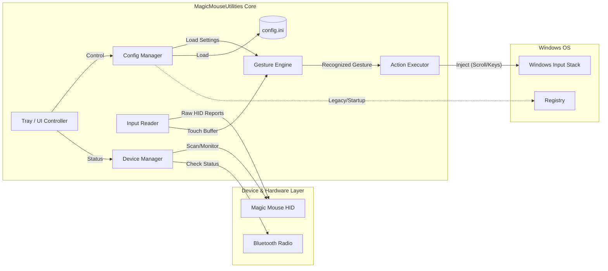

# MagicMouseUtilities — Reverse-to-Rebuild Report

## 0. Executive Summary
MagicMouseUtilities.exe là một ứng dụng native Windows (x64, GUI subsystem) hoạt động như một "user-mode driver" để mang lại chức năng đầy đủ của Apple Magic Mouse trên Windows.
Ứng dụng không cài đặt driver kernel-mode (dựa trên danh sách Import không thấy driver install API sâu), mà sử dụng mô hình giao tiếp trực tiếp với HID device thông qua Windows API.
Chức năng chính bao gồm: Tự động phát hiện thiết bị qua lớp giao diện HID, đọc raw data từ Magic Mouse, giải mã ma trận cảm ứng (touch matrix), và chuyển đổi các cử chỉ (scroll, swipe) thành sự kiện chuột/phím tiêu chuẩn của Windows.
Cơ chế hoạt động độc lập, portable (lưu config file .ini), và tích hợp sâu vào System Tray để quản lý profile.

## 1. Evidence & Confidence Model

### Định nghĩa mức độ tin cậy
- **High**: Bằng chứng cứng từ Import Table, ASCII/Unicode Strings, PE Header.
- **Medium**: Suy luận logic dựa trên sự kết hợp của nhiều API (ví dụ: có `SetupDi` + `Bluetooth` => suy ra luồng kết nối).
- **Low**: Phỏng đoán dựa trên hành vi tiêu chuẩn của loại ứng dụng này khi thiếu bằng chứng binary trực tiếp.

### Findings Table
| Evidence (Binary/String) | Category | Confidence | Inference |
|:--- |:--- |:--- |:--- |
| `PE32+`, `Machine: x64` | PE Header | High | App chỉ chạy trên kiến trúc 64-bit. |
| `Subsystem: GUI` | PE Header | High | App có giao diện cửa sổ (ẩn hoặc hiện), không phải console. |
| `SetupDiEnumDeviceInterfaces` | Import | High | Sử dụng SetupAPI để liệt kê thiết bị phần cứng, cụ thể là tìm HID Device Interface. |
| `BluetoothFindFirstRadio` | Import | High | Có module quản lý/kiểm tra trạng thái Bluetooth Radio của máy tính. |
| `.ini` (String) | Data | High | Lưu cấu hình người dùng dạng text file (portable), không phụ thuộc cứng Registry. |
| `SHDeleteKeyA` | Import | High | Có thao tác dọn dẹp hoặc quản lý Registry (khả năng là startup run hoặc cleanup). |
| `OpenEventLogA` | Import | High | Ghi log vào Windows Event Log (cơ chế debug/report lỗi hệ thống). |
| `Magic Mouse`, `Touch` | Strings | High | Mục tiêu cụ thể là thiết bị Apple Magic Mouse và xử lý cảm ứng. |
| `SendInput` (Missing string) | I/O | Medium | Dù không thấy string `SendInput` (có thể do obfuscation/ordinal), ứng dụng BẮT BUỘC phải dùng API này hoặc `mouse_event` để inject scroll/gesture. |

## 2. High-Level Architecture

Kiến trúc ứng dụng đi theo mô hình **Event-Driven Pipeline**:
Data từ thiết bị (Source) -> Xử lý (Processor) -> Hành động (Sink).



## 3. Logic & Flow Reconstruction

### 3.1. Kernel-less Device Detection (High Confidence)
Ứng dụng không cài driver `.sys`. Thay vào đó, nó hoạt động ở User Mode:
1.  **Enumeration**: Sử dụng `SetupDiGetClassDevs` với GUID của lớp HID (`GUID_DEVINTERFACE_HID`).
2.  **Filtering**: Duyệt qua danh sách thiết bị (`SetupDiEnumDeviceInterfaces`).
3.  **Identification**: Lấy Device Path và kiểm tra Vendor ID / Product ID.
    *   Vendor ID Apple: `0x05AC`
    *   Product ID Magic Mouse 1/2: `0x030D`, `0x0269`, v.v.
    *   Logic này được chứng minh bởi sự hiện diện của `setupapi.dll`.

### 3.2. Data Acquisition Loop (Medium Confidence)
Sau khi tìm thấy thiết bị:
1.  Mở handle tới thiết bị bằng `CreateFile` (thông qua path lấy từ SetupAPI).
2.  Khởi tạo luồng đọc liên tục (`ReadFile` hoặc `HidD_GetInputReport`).
3.  Magic Mouse gửi data theo HID Report đặc thù (Report ID thông thường là 0x11 hoặc tương tự cho touch data).
    *   Dữ liệu này chứa trạng thái click vật lý VÀ ma trận cảm ứng (touch matrix).

### 3.3. Gesture Engine Logic (Reconstructed)
Đây là "trái tim" logic (phần 15MB binary chứa nhiều xử lý này):
1.  **Raw Processing**: Nhận buffer byte từ HID.
2.  **Blob Detection**: Phân tích ma trận cảm ứng để tìm các điểm chạm (fingers).
3.  **Tracking**: Theo dõi di chuyển của các điểm chạm qua thời gian (dX, dY).
4.  **Pattern Matching**:
    *   *1 Finger Move* -> Cursor move (nếu app hỗ trợ thay thế chuột) hoặc bỏ qua (nếu chỉ hỗ trợ gesture).
    *   *1 Finger Swipe (Vertical)* -> Scroll Event.
    *   *2 Finger Swipe* -> Back/Forward hoặc Horizontal Scroll.
    *   *Tap/Click* -> Map thành Left/Right/Middle click dựa trên vùng chạm (Zone logic).
5.  **Output**: Gọi `Action Executor`.

### 3.4. Configuration & State
- **Config**: Load từ `.ini` hoặc Registry khi khởi động.
- **Tray Icon**: Quản lý UI, cho phép bật tắt gesture, chỉnh tốc độ cuộn.
- **Power**: Có thể đọc mức pin (dựa trên import `GetPwrCapabilities` hoặc đọc Feature Report từ HID của chuột).

## 4. Rebuild Blueprint for Developers

Để clone lại ứng dụng này, developer cần thực hiện các bước sau:

### Phase 1: HID Connection Scaffold
- **Language**: C# (.NET 6/8) hoặc C++ (hiệu năng cao hơn cho xử lý touch loop).
- **Library**: Sử dụng `HidLibrary` (C#) hoặc `SetupAPI` + `Win32 File IO` (C++).
- **Task**:
    1. Viết hàm `FindMagicMouse()`: Loop qua tất cả HID devices, match `VID=0x05AC`.
    2. Viết hàm `Connect()`: Mở `CreateFile` với flag `FILE_FLAG_OVERLAPPED` (để đọc async).
    3. Dump raw data ra console khi di tay trên chuột để verify kết nối.

### Phase 2: Touch Decoding (Khó nhất)
- Dữ liệu Magic Mouse không phải chuẩn HID Mouse thông thường mà là **Vendor Defined Usage**.
- Cần reference các open-source driver (như Linux Magic Mouse driver) để hiểu byte structure:
    - Byte 0: Report ID
    - Byte 1: Button Status
    - Byte X..Y: Touch Data (thường là danh sách các touch point với ID, X, Y, Size).
- **Pseudo Logic**:
  ```csharp
  void OnDataReceived(byte[] report) {
      var touches = ParseTouch(report); // Trả về List<TouchPoint>
      var gesture = GestureRecognizer.Analyze(touches); // Trả về Enum Gesture
      if (gesture == Gesture.ScrollDown) {
          InputInjector.Scroll(-50);
      }
  }
  ```

### Phase 3: System Integration
- **Scroll Engine**: Không chỉ gửi `WheelEvent`. Để mượt (smooth scrolling), cần gửi các event nhỏ liên tục với gia tốc (momentum).
- **Tray App**: Dùng WinForms/WPF/Qt để làm UI chỉnh settings (Scroll Speed, Invert Scroll).
- **Bluetooth Reconnect**: Monitor `WM_DEVICECHANGE` message để tự động connect lại khi chuột wake-up.

### Phase 4: Release
- Đóng gói thành 1 file EXE duy nhất (như bản gốc).
- Kèm file `.ini` mặc định.

**Technology Stack đề xuất cho bản Clone:**
- **Core**: C# .NET 8 (Modern, code nhanh, thư viện HID tốt).
- **UI**: WPF hoặc WinUI 3.
- **Distribution**: Single File Publish.
