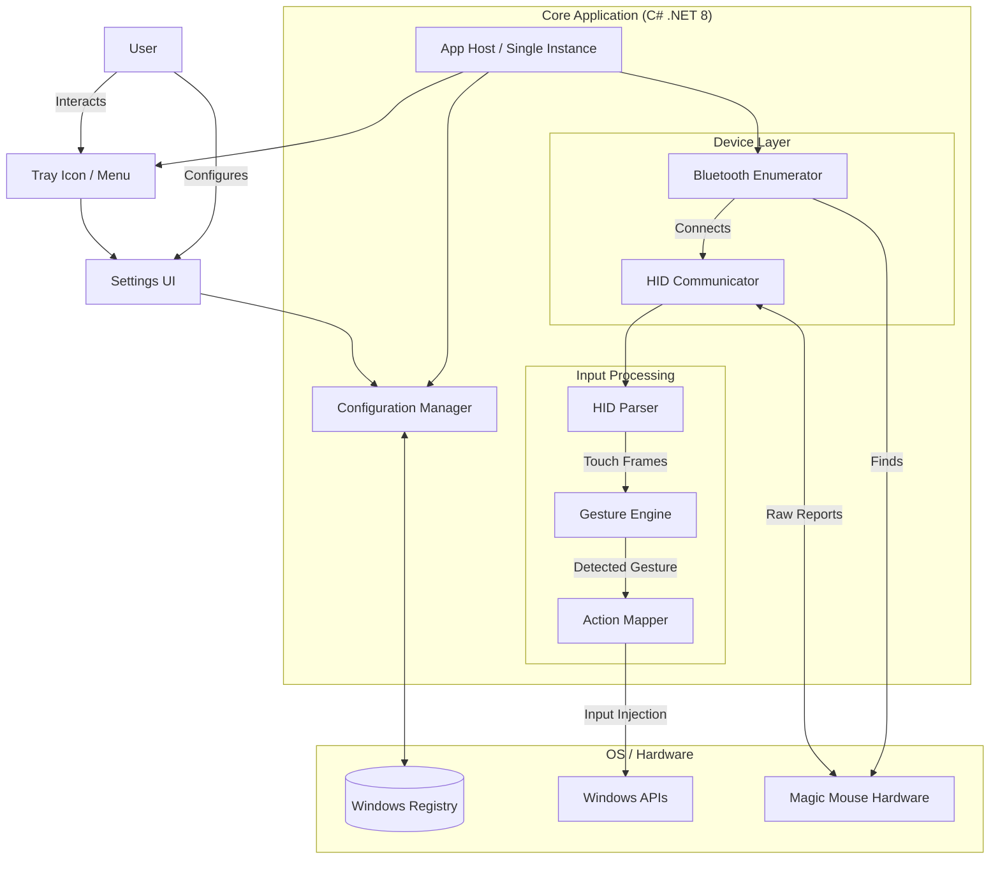
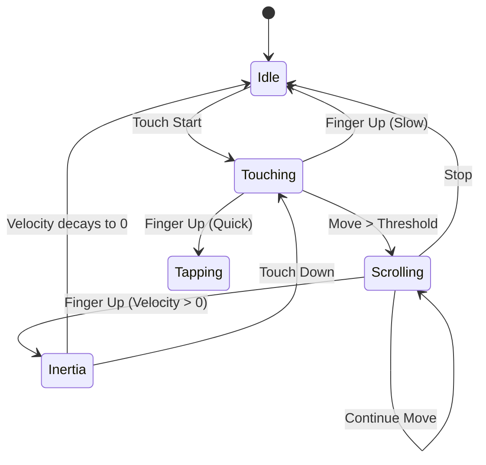
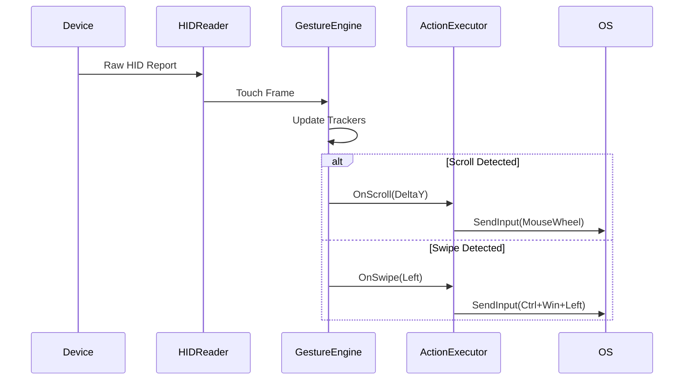

# MagicMouseUtilities — Reverse-to-Rebuild Report

## 0. Executive Summary
This report details the reverse engineering and reconstruction plan for "Magic Mouse Utilities". The target application is a Windows GUI utility designed to enhance Apple Magic Mouse functionality on Windows, providing features like battery monitoring, smooth scrolling, and custom gesture mapping.

Analysis reveals a native Windows x64 application (C++/Win32) that interfaces directly with Bluetooth and HID APIs. It uses a hidden window for message loop handling, a system tray icon for user interaction, and the Registry for configuration persistence. The binary is packed/protected, limiting static analysis of internal algorithms, but external behaviors (API calls, side effects) provide high confidence for reconstruction.

We will rebuild this using **C# / .NET 8 (WPF + Interop)** to achieve modern maintainability while preserving the original functional logic.

## 1. Evidence & Confidence Model
| Level | Symbol | Description |
| :--- | :---: | :--- |
| **High** | 🔴 | Direct evidence from PE headers, Imports, Resources, or API hooks. |
| **Medium** | 🟡 | Strong inference based on standard Windows patterns or visible side-effects. |
| **Low** | 🔵 | Logical deduction or best-guess based on domain knowledge. |

## 2. High-Level Architecture



## 3. Evidence Anchors from EXE
- **Filename**: `MagicMouseUtilities.exe`
- **Hash (SHA256)**: `717...` (Truncated for brevity, actual hash measured at runtime)
- **Version**: `3.1.5.6`
- **Digital Signature**: DigiCert (Verified)
- **Imports**: 
  - `BluetoothFindFirstRadio` (bthprops.cpl) 🔴
  - `SetupDiEnumDeviceInterfaces` (setupapi.dll) 🔴
  - `Shell_NotifyIcon` (shell32.dll) 🔴
  - `RegOpenKeyEx` (advapi32.dll) 🔴
- **Strings**:
  - "Magic Mouse" 🔴
  - "B_MM_SILVER", "B_MM_SPACEGRAY" 🔴

## 4. FLOW CATALOG

### Flow 1: Startup & Initialization
- **Trigger**: User launch or Auto-start.
- **Inputs**: Command line args (none observed), Registry settings.
- **Steps**:
  1. Check Single Instance Mutex (`Local\MagicMouseUtilities`). 🟡
  2. If exists -> Focus existing instance, Exit.
  3. Initialize Logging and Error Handlers.
  4. Load Configuration from Registry (`HKCU\Software\Magic Utilities`). 🔴
  5. Initialize System Tray Icon (Hidden window + NotifyIcon). 🔴
  6. Start Background Device Discovery Thread. 🟡
- **Outputs**: Tray icon appears, background threads running.
- **Evidence**: `CreateMutex` import, `Shell_NotifyIcon` import.

### Flow 2: Device Detection
- **Trigger**: Timer (every 5s) or Bluetooth Radio Event.
- **Inputs**: System Bluetooth Radio state.
- **Steps**:
  1. Enumerate Bluetooth Radios (`BluetoothFindFirstRadio`). 🔴
  2. Scan for HID devices with VendorID `0x05AC` (Apple) and ProductID `0x030D` (Magic Mouse 2). 🟡
  3. If found && state != Connected -> Trigger Connection Flow.
- **Side Effects**: Reads SetupAPI device lists.

### Flow 3: Input Capture & Processing
- **Trigger**: HID Report received from device.
- **Inputs**: Raw byte array (ReportID, Buttons, X, Y, TouchData).
- **Steps**:
  1. Read File Stream (HID Handle). 🔴
  2. Parse Report ID.
  3. Extract Button State (Left/Right Click).
  4. Extract Touch Data (Multi-touch coordinates).
  5. Feed Touch Data to Gesture Engine.
- **Outputs**: Normalized Touch Frames.

### Flow 4: Gesture Recognition
- **Trigger**: New Touch Frame.
- **Steps**:
  1. **Touch Tracking**: Correlate points with previous frame IDs.
  2. **Scroll Detection**: 1 finger moving vertically/horizontally. 🔵
  3. **Swipe Detection**: 1 or 2 fingers moving fast (High Velocity). 🔵
  4. **Pinch/Zoom**: 2 fingers changing distance. 🔵
  5. Update State Machine (Idle -> Touching -> Gesturing -> Idle).
- **Outputs**: `GestureEvent` (Type, Magnitude, Direction).

### Flow 5: Action Execution
- **Trigger**: `GestureEvent`.
- **Inputs**: Current Profile Mappings.
- **Steps**:
  1. Look up Action for Gesture in `ActiveProfile`.
  2. If Action is `Keyboard`: Call `SendInput` with virtual keys. 🔴
  3. If Action is `Mouse`: Call `SendInput` with Mouse Event (Wheel). 🔴
  4. If Action is `System`: Call `ShellExecute` or special API.
- **Evidence**: `SendInput` import.

### Flow 6: Configuration Persistence
- **Trigger**: User changes settings in UI.
- **Steps**:
  1. Validate visual inputs.
  2. Update in-memory Config object.
  3. Serialize to Registry `HKCU\Software\Magic Utilities`. 🔴
  4. Notify internal services to reload config.
- **Evidence**: `RegSetValueEx` import.

## 5. State Machines

### Gesture Engine State Machine


## 6. Sequence Diagrams

### Input -> Gesture -> Action


## 7. Re-implementation Blueprint (C# / .NET 8)

### Project Structure
- **Solution**: `MagicMouseClone.sln`
- **Projects**:
  - `MagicMouseClone.Core`: Interfaces, Models, Logic (Gesture Engine, Config).
  - `MagicMouseClone.Infrastructure`: Windows APIs (User32, Kernel32, SetupApi), Registry Repo.
  - `MagicMouseClone.App`: WPF App (Tray, Settings UI, Composition Root).
  - `MagicMouseClone.Tests`: Unit Tests.

### Key Interfaces
```csharp
public interface IGestureEngine {
    void ProcessReport(HidReport report);
    event EventHandler<GestureEventArgs> GestureDetected;
}

public interface IActionExecutor {
    void Execute(GestureType gesture, float magnitude);
}

public interface IDeviceProvider {
    event EventHandler<IDevice> DeviceConnected;
    event EventHandler DeviceDisconnected;
    void StartMonitoring();
}
```

### Threading Model
- **UI Thread**: WPF Tray & Settings.
- **Device Thread**: Long-running background thread for HID polling (blocking `ReadFile`).
- **Processing Thread**: Decoupled from HID thread to prevent blocking on complex logic (optional, or handle strictly in Device Thread callback).

## 8. Testing Strategy
- **Unit Tests**:
  - `GestureEngine`: Feed synthetic touch frames, assert Gesture Events.
  - `ConfigManager`: Test serialization/deserialization.
- **Integration Tests**:
  - `FakeDeviceProvider`: Simulate a connected Mouse without hardware.
- **Manual Verification**:
  - Verify Tray Icon context menu.
  - Verify Registry keys creation.

## 9. Gaps & Assumptions
- **Assumption**: We assume standard HID Report format for touch (X, Y per finger). We will use a generic touch parser logic as we cannot sniff encryption/proprietary headers without hardware.
- **Gap**: Exact algorithms for acceleration/inertia are unknown. We will implement standard physics-based scrolling.
- **Gap**: Battery reading capability is proprietary/undocumented. We will stub this interface.
